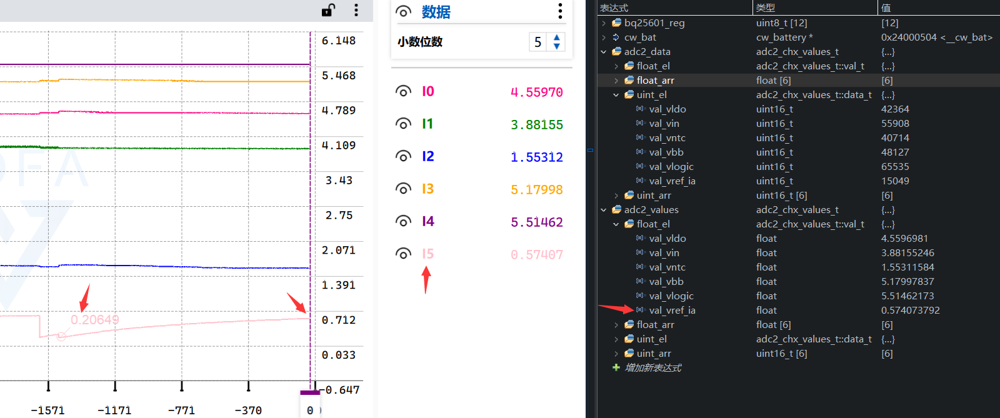

## DS-PPK_ANALOG_01

在 DS-PPK_CW2015_01 基础上修改

>已支持的：USB VCP、HC4051、BQ25601、CW2015
>
>待加入的：HC138按键读取，ADC+DAC+PID 闭环控制VLOGIC 和 VLDO 的输出电压，自动量程换挡

## SMU

### 命令开关

USB发送命令 A+SMU_TURN_ON 或 A+SMU_TURN_OFF 来打开或关闭 TPS65131、TPS63020、TPS7A8300电源芯片，上电默认关闭

## VREF+

使用外部2.5V基准REF5025，CubeMX 里 VREFBUF 选择External voltage reference 后就OK

## ADC2

### 参考

- armfly v7 BSP 第44章 STM32H7 的ADC基础知识和HAL 库 API

  > 

- armfly v7 BSP 第46章 STM32H7 的ADC应用之DMA方式多通道采样

  > 配置 PLL2 时钟为的 72MHz，方便分频产生 ADC 最高时钟 36MHz
  >
  > >  25 / 25 * 504 / 7 = 72

- [梳理STM32H743的ADC在CubeMX上的配置](https://bbs.21ic.com/icview-3161602-1-1.html)

  > ### 同步时钟 异步时钟？
  >
  > 4.1.1、Clock Prescaler（时钟预分频）
  > 目的是让ADC的工作频率达到36M（ADC工作频率超过36M会不稳定）。异步时钟模式（基于PLL2P时钟）可以选择Asynchronous clock mode divided by 1，2，4，6，8，10，12，16，32，64，128，256，同步时钟模式（基于AHB时钟）可以选择Synchronous clock mode divided by 1，2，4。在上面的时钟配置上，adc_ker_ck的时钟频率为70M，所以使用Asynchronous clock mode divided by 2就能让ADC的工作频率为36M。
  >
  > 配置ADC的时钟源adc_ker_ck的频率为72M。有了72M的时钟源，ADC1，ADC2，ADC3就能经过异步时钟模式2分频得到36M的最高的工作频率
  >
  > *ADC*的*时钟*分频：通过对AHB总线的*时钟*信号进行分频得到的*时钟*即为*同步时钟*，直接对系统*时钟*进行分频得到*ADC时钟*即为异步*时钟*
  >
  > 同步时钟模式任何选项都会让ADC的工作频率超过36M。STM32H743的时钟频率是480M，所以AHB时钟频率是240M。就算选择Synchronous clock mode divided by 4， ADC的工作频率也超过36M（240M/4 = 60M）。那么同步时钟模式就那么没有使用的价值吗？查看官方手册，同步模式的优点在于ADC与定时器都基于AHB时钟，那么定时器触发定时器时，ADC的同步触发能更加精确。
  >
  > CubeMX实测ADC2要用同步时钟代价好大啊，除CPU，所有外设时钟都得一起降低。。。
  >
  > |  |  |
  > | ----------------------------------------- | ---------------------------------------------- |
  >
  > 算了还是用异步时钟

### 配置

仅6个规则通道循环采集 + DMA循环，无注入通道

以下几个参数要配置CubeMX时要特别注意一下，出处：第44章 STM32H7 的ADC基础知识和HAL 库 API

> ```c
> AdcHandle.Init.ConversionDataManagement = ADC_CONVERSIONDATA_DMA_CIRCULAR; /* DMA 循环模式接收 ADC 转换的数据 */
> AdcHandle.Init.BoostMode = ENABLE; /* ADC 时钟超过 20MHz 的话，使能 boost */ 
> AdcHandle.Init.Overrun = ADC_OVR_DATA_OVERWRITTEN; /* ADC 转换溢出的话，覆盖 ADC 的数据寄存器 */
> ```
>
> ## ConversionDataManagement
>
> 此参数成员用于ADC采集数据的管理，具体支持的参数如下：
>
> ```c
> /** @defgroup ADC_ConversionDataManagement ADC Conversion Data Management
>   * @{
>   */
> #define ADC_CONVERSIONDATA_DR    ((uint32_t)0x00000000)  					  // 可以存到ADC的DR寄存器
> #define ADC_CONVERSIONDATA_DFSDM               ((uint32_t)ADC_CFGR_DMNGT_1)    	//传输给DFSDM                 
> #define ADC_CONVERSIONDATA_DMA_ONESHOT         ((uint32_t)ADC_CFGR_DMNGT_0)     // DMA单次传输数据到指定地址
> #define ADC_CONVERSIONDATA_DMA_CIRCULAR        ((uint32_t)(ADC_CFGR_DMNGT_0 | ADC_CFGR_DMNGT_1)) //DMA循环模式传输数据到指定地址
> ```
>
> 使用此参数成员注意以下问题：
>
> 如果参数成员ContinuousConvMode配置为连续转换模式（即 ADC_CONVERSIONDATA_DMA_CIRCULAR），那么DMA必须配置为循环模式，否则会造成DMA传输溢出
>
> 运行时修改：仅当规则通道上没有后续的转换时才可以修改此参数（即ADC禁止的情况下或者ADC单次转换模式，又或者无外部触发）
>
> ## BoostMode
>
> 用于设置ADC的BOOST模式，当ADC的时钟**高于20MHz**时，必须使能此位
>
> ## Overrun
>
> 用于配置ADC转换数据未及时读取，造成溢出时的处理，可以选择继续保留上次转换的数据，也可以选择新转换的数据覆盖，具体支持的参数如下：
>
> ```c
> #define ADC_OVR_DATA_PRESERVED        ((uint32_t)0x00000000)      
> #define ADC_OVR_DATA_OVERWRITTEN       ((uint32_t)ADC_CFGR_OVRMOD)  
> ```
>
>
> 使用此参数成员注意以下问题：
>
>  此参数**仅可用于规则通道**。
>
>  如果此参数设置为保留上次转换的数据（即 ADC_OVR_DATA_PRESERVED ），并在HAL_ADC_Start_IT()的中断服务程序里面去的清除转换结束标志，会导致保存的数据被释放。针对这种情况，用户可以在中断服务程序的回调函数HAL_ADC_ConvCpltCallback里面保存转换的数据（此回调函数是在清除转换结束标志前调用）。
>
> 如果ADC转换采用查询或者中断方式且此参数被设置为保留上次转换的数据，会产生错误报告。此参数设置为覆盖方式，那么用户不读取数据时，不会被视为溢出错误
>
> **如果ADC转换采用DMA方式，不管此参数配置为何种方式，都会报告溢出错误**（因为**DMA需要处理所有转换的数据**）
>
> > 备注：CubeMX 默认OversamplingMode 是 ADC_OVR_DATA_PRESERVED，若使用DMA，则此参数不用管
>
> ## LeftBitShift
>
> 用于设置ADC转换结果的左移位数，使用或者没有使用过采样的情况下，都可以使用此参数，支持1-15位左移
>
> > 备注：DS-PPK合成数据帧时可以设置12bit模式下左移4位，即 aaaa,aaaa,aaaa,0000，这样H7将其与自动量程的 0000,vvvv合成16bit数据帧时，就不用CPU进行移位运算，直接&运算就行，得到 aaaa,aaaa,aaaa,vvvv

### 时钟

DS-PPK ADC2负责轮询采集多个通道数据，这些通道的RC滤波器带宽 350Hz 左右，配置 ADC采样频率为 5倍以上带宽，即2KHz，采样时间给最大的810.5cycles，转换时间 = 采样时间 + 逐次逼近时间 = 810.5 + 8.5(16bit) = 820cycles，那么ADC2时钟 = 820 x 2KHz = 1.640MHz，时钟源钟不取72MHz，取64MHz方便二进制：

```c
64 MHz / 6 PSC / 820 Cycles / 6 CHx = 2.168KHz（因为有6个通道所以除以6）
```

### 测试

万用表测量DAC后VREF_IA会降低到0.2V，之后慢慢升到0.5V以上，推测是IA_OFFSET对应 DAC_OUT1 引脚还未使能处于开漏，导致DAC输出接的100nF电容慢慢充电所致，万用表测量的瞬间从100nF电容汲取电流，电容放电，VREF_IA 降低



## ADC1、ADC3

各采集一路差分通道，需要用同一个定时器触发ADC1和ADC2的转换

ADC采样频率不再与其自身循环采集相关（即 配置参数自动转换 ContinuousConvMode 由 ADC2 的ENABLE 变为 DISABLE），而是由定时器事件控制，这里选择 LPTIM2

### 参考

- armfly v7 BSP 第45章 STM32H7 的ADC应用之定时器触发配 合DMA双缓冲

### 配置

ADC转换时间需要小于 LPTIM2_OUT 周期，这样 DMA 搬运数据的频率才能和 LPTIM2_OUT 一样，保持同步

> ~~看一个数据从TIM信号产生到DMA传输完成的周期，即LPTIM->ADC转换->DMA搬运，TIM信号产生到DMA传输完成有滞后时间，如果用DMA半满或满中断的时间戳去反推缓冲区内某一ADC数据的时间戳，那么计算出的时间戳与控制该数据采集的TIM信号的时间戳有滞后，最大是滞后时间小于LPTIM2_OUT 周期（在1Gsa/s的示波器上搞信号触发对齐时基线时这个滞后时间在对齐信号时可能是需要补偿的？）~~
>
> 对于DS-PPK，只有100Ksa/s，最大滞后时间只有10us，问题不大，暂不考虑滞后补偿，考虑的话得再记录一下LPTIM OUT 事件开始，半满，完成DMA，对应的时间戳，当然这个时间戳不能用systick，1ms的粒度太粗糙了，得再开一个32bit定时器做 0.1us时间步进做时间戳，32bit是0 到+ 4 294 967 29.4us，429.4秒就溢出，约1.19小时，H7进出中断最快12.5MHz，周期0.08us

ADC1

> 64 MHz / 8 DIV / 100 KHz = 80cycles
>
> ADC空转周期 = 90 - 64.5 - 8.5 = 7cycles
>
> （差分模式只是输入为差分双端，转换速度按照1个通道计算）
>
> ```c
> AdcHandle.Init.ScanConvMode      = ADC_SCAN_DISABLE;         /* 禁止扫描，因为仅开了一个通道 */
> AdcHandle.Init.ContinuousConvMode  = DISABLE;               /* 禁止自动转换，采用的定时器触发转换 */
> ```
>
> DMA优先级：very high

ADC3

> 与ADC1一样，除了DMA优先级改为：high

LPTIM

> 将USB时钟源从PLL3Q 改为 RC48，PLL3提供1.28MHz PLL3R 给LPTIM1 做时钟源
>
> 
>
> LPTIM 的 PSC 和 ARR 的乘积要等于时钟源，PSC只支持3bit分频（1、2、4、8、16、32、64、128），ARR范围 0~65535，那么最慢的采样频率上下限：
>
> - 最慢取整：6.4MHz / 128PSC / 50000ARR = 1Hz
>
> - 最快：6.4MHz / 1PSC / 2ARR = 3.2MHz
>
> - 标准：6.4MHz / 1PSC / 64ARR = 100KHz
>
> - 其他：
>
>   > | PSC  | ARR  | Hz    |
>   > | ---- | ---- | ----- |
>   > | 1    | 64   | 100K  |
>   > | 1    | 80   | 80K   |
>   > | 1    | 100  | 64K   |
>   > | 1    | 125  | 51.2K |
>   > | 1    | 1250 | 5.12K |

### 测试

DMA缓冲区开 1000 个样本，，ADC1和ADC3共用触发源LPTIM定时器频率 1000KHz

```c
[12:28:22.447] VDOUT: 4.391199		//ADC3
[12:28:22.447] IA_SE_OUT: 0.547756	//ADC1
```

