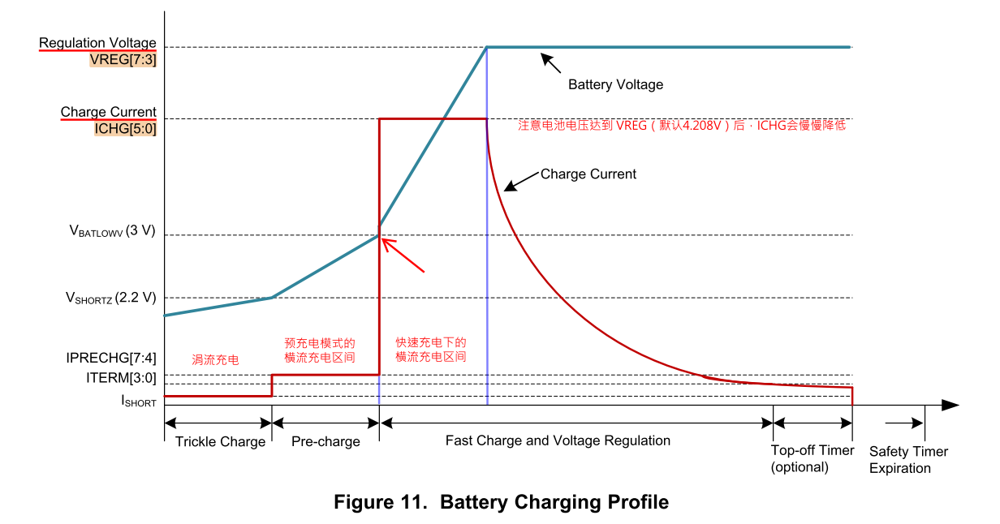

## DS-PPK_BQ25601_01

## 简介

DS-PPK v1.0 项目的BQ25601驱动demo

## BQ25601 的一些疑问

### PSEL引脚

> DS-PPK v1.0 是悬空的，独立模式下LOW是2.4A，HIGH是500mA

[BQ25601能否改变PSEL处于高电平时的充电电流？](https://e2e.ti.com/support/power-management-group/power-management/f/power-management-forum/919931/bq25601-can-bq25601-change-the-charge-current-when-the-psel-is-in-high-level)

> PSEL 在我的客户电路中始终处于高电平，这导致输入电流限制仅为 500mA。客户已尝试向 WD_RST 位写入 1 以退出默认模式并通过 I2C 将输入电流限制更改为 2A。但输入电流限制仍然是 500mA。BQ25601 能否在 PSEL 处于高电平时将充电电流更改为 2A？谢谢！
>
> 回复
>
> PSEL 设置默认输入电流限制。一旦建立了主机通信（上电），主机就**可以使用 IINDPM 寄存器覆盖 PSEL 设置的输入电流限制**。输入源检测完成后，主机可以覆盖 IINDPM 寄存器位。
>
> PSEL 限制在上电之后和 I2C 通信配置寄存器之前存在。

[BQ25601: Can left PSEL pin float?](https://e2e.ti.com/support/power-management-group/power-management/f/power-management-forum/749459/bq25601-can-left-psel-pin-float)

> 我的客户在低电量模式下遇到一些充电问题，需要在插入 VBUS 时将设计 PSEL 从拉高 500mA 充电到拉低 2A。但该项目状态接近MP阶段，无法在PSEL引脚上加拉低电阻。那么，我们能否让PSEL引脚悬空，让它成为2A模式呢？我测试了 EVM，当我浮动 PSEL 引脚时，它似乎总是 2A。感谢评判和帮助！
>
> 回复
>
> 数据表并未表明 PSEL 上有下拉电阻。大多数 IC 的 PSEL 管脚不会浮高；但是，我无法保证在所有操作条件下所有 IC 的 PSEL 都处于浮动状态。

## 地址扫描

总线上哟个24C64，返回的7bit地址在0x58响应了一次，应该是BUG，因为 24C64的内部地址寻址是16bit，这样7bit 地址0x50相当于 10100000 8bit地址，就是写命令，然后 扫描 i2c 后面的 0x51、0x52 看作写模式的 EEPROM内部寻址地址，后面的 0x53 7bit 是 1010011，8bit是 10100110，看作单次写入...有点头晕，算了不分析了，反正三个设备地址都扫得到：

```c
MCU: i2c2 scan...
addr: 0x50 is ok	1010000	// BL24C64A-NTR，引脚A0~A2都是GND
addr: 0x58 is ok	1011000	// ???
addr: 0x62 is ok	1100010	// CW2015
addr: 0x6B is ok	1101011	// BQ25601
```

## i2c读写API

BQ25601挂在i2c2上，i2c2上还有cw2015和24c64，一共三个设备，可能存在多个优先级不同或相同的任务分别访问一路I2C的多个设备，因此i2c访问需要加入互斥锁，本id使用魔改的I2C_Wrapper库处理

[STM32的HAL库中硬件IIC，HAL_I2C_Master_Receive函数与HAL_I2C_Mem_Read函数的区别](https://blog.csdn.net/z12345654/article/details/123284178)

> 如果从某从设备读数据，则用HAL_I2C_Master_Receive()
> 如果是外设有子地址，例如EEPROM，有从机地址和寄存器地址，则用HAL_I2C_Mem_Read()
> Mem_Read是2个地址，Master_Receive只有从机地址
>
> 如果写数据到某从设备，则用HAL_I2C_Master_Transmit()
> 如果是外设有子地址，例如EEPROM，有从机地址和寄存器地址，则用HAL_I2C_Mem_Write()
> Mem_Write是2个地址，Master_Transmit只有从机地址

## 驱动需求

初始化，关机（写BATFET寄存器），没有分配IRQ引脚，不需要中断线程处理中断引脚，但需要 HC138 的轮询事件 检测 **STAT引脚** 以获取充电状态，设置充电电流，获取电流，电压

## 现成驱动

> BQ25601可配置的功能过多，而以单片机为主控的中低端的产品一般不会考虑（TP4056完事），所以网上找到的库几乎都是Linux的驱动

### Linux主线内核驱动路径

`linux/drivers/power/supply/bq256xx_charger.c`

其中，电源管理芯片 后缀 叫 charger，电量计后缀叫 battery

该文件为德州仪器官方对 BQ256xx 编写的兼容驱动，对后缀为 BQ256xx的所有系列都进行适配，捆绑 Linux Power supply 子系统的API，移植需要裁剪的工作量很大

驱动分层参考：[深入浅出理解Power Supply](https://deepinout.com/android-system-analysis/android-performance-power-related/easy-to-understand-power-supply.html)

> 梗概：
>
> Android供电系统框架 
>
> 
>
> power supply(以下简称psy)是Linux中从供电驱动抽象出来的子系统，是Linux电源管理的重要组成部分。psy是一个中间层，在kernel中是属于设备驱动的一部分，psy的作用主要是向用户空间汇总各类供电的状态信息。抽象出来的各类信息称为property，比如供电设备是否连接就对应着POWER_SUPPLY_PROP_ONLINE。
>
> 在驱动层分两大模块，与电池相关的驱动和与充放电管理相关的驱动（对应图中的battery.c和charger.c）,这两大模块主要处理硬件相关的逻辑，在硬件状态发生变化时，会触发相关的中断，驱动层会调用相应的中断函数，并更新修改相应的 psy节点值。驱动负责更新psy节点的状态，HAL层会去读这些节点，驱动在检测硬件、传感器信息变化会去更新节点值
>
> ...

### MediaTek 联发科驱动

在 github 上搜索 BQ25601，有 8K Code，其中很大一部分都是 联发科 2016 年编写Linux的开源驱动

[kernel_xiaomi_mt6768/drivers/power/supply/mediatek/charger/bq25601.c](https://github.com/dotOS-Devices/kernel_xiaomi_mt6768/blob/3e2496d807ae09f10b0ee2db996f8e829b89f537/drivers/power/supply/mediatek/charger/bq25601.c)

该驱动很好懂，API与内核封装层的东西捆绑得最少，很方便移植到STM32上

### 小米驱动

红米5A 使用 BQ25601 做电源管理，在小米内核的开源仓库内的此分支可以找到

https://github.com/MiCode/Xiaomi_Kernel_OpenSource/tree/riva-n-oss/drivers/power

分   bq2560x.h、bq2560x_charger.c、bq2560x_reg.h，兼容BQ25600、BQ25601，该驱动所有功能都实现了

### mikrosdk_click_v2：charge6

[mikrosdk_click_v2/tree/master/clicks/charger6](https://github.com/MikroElektronika/mikrosdk_click_v2/tree/master/clicks/charger6)

这个驱动有点简陋了，很多功能没有写成API

## 驱动比较

那么我该选择哪个驱动移植到H750的FreeRTOS呢？

比较后，选择联发科和小米的驱动移植到STM32环境，分别创建 DS-PPK_BQ25601_01 和 DS-PPK_BQ25601_02 工程

## 测试

### 打印所有寄存器


### VCP解析命令控制BATFET的开关

> BQ25601实现关机只能写寄存器控制BATFET关闭，对应的功能是不充电下的关机，“不充电下的关机” 是什么鬼？手机插电是无法完全关机的，不信你试试~

在ascii_protocol.cpp中插入以下命令：

```C++
void OnAsciiCmd(const char* _cmd, size_t _len, StreamSink &_responseChannel)
{
	...
	else if (_cmd[0] == '^')
    {
        std::string s(_cmd);
        if (s.find("BATFET_TURN_OFF_FAST") != std::string::npos)
        {
            Respond(_responseChannel, false, "Turn off BATFET immediately");
            bq25601_set_batfet_delay(0);
            bq25601_set_batfet_disable(1);
        }
        else if (s.find("BATFET_TURN_OFF_SLOW") != std::string::npos)
        {
            Respond(_responseChannel, false, "Turn off BATFET after t(BATFET_DLY) (typ. 10 s)");
            bq25601_set_batfet_delay(1);
            bq25601_set_batfet_disable(1);
        }
        else if (s.find("BATFET_TURN_ON") != std::string::npos)
        {
            Respond(_responseChannel, false, "Turn on BATFET");
            bq25601_set_batfet_disable(0);
        }
    }
...
}
```

然后接通BQ25601的电源，接一个电压小于4.0V的锂电池，可以发送以下命令测试

立即关闭BATFET

```shell
^BATFET_TURN_ON
^BATFET_TURN_OFF_FAST
```

延时10s左右关闭BATFET

```
^BATFET_TURN_ON
^BATFET_TURN_OFF_SLOW
```

使用万用表测量锂电池电压，即可确认BATFET是否打开，打开锂电池电压4.2V左右处于充电状态，关闭即停止充电电压小于4.0V

延时关机的10s典型时间，本id手头的片子实测是12s左右

### DS-PPK v1.0 关机状态锂电池电流

断开USB的VBUS，仅USB和GND连接DS-PPK，锂电池串联电流表，测得运行时锂电池电流200mA左右，BQ25601关断BATFET下锂电池电流**37uA**，此时锂电池还在给BQ25601关机模式，CW2015上电默认模式，加速度上电默认模式计休眠模式，H750的VBAT直供电流，说明DS-PPK的关机电流控制还算成功

关机下，短接 BQ25601 的 QON 引脚到 GND，可正常打开BATFET开机，此状态电脑能识别USB VCP，可继续发送测试命令关机

### PSEL悬空电压

不论是否接入充电头或是否充电，电压0--0.18V左右

### 充电电流

电路上BQ25601的PSEL引脚悬空，H750写ICHG位设置快速模式下充电电流为1.5A，电源输入电流限制3A，对应代码：

```c
uint8_t bq25601_hw_init(void)
{
	uint8_t status = 0;
	bq25601_set_input_current(3000000);			/* uA, 3.0A 	REG00	xxx1,1101 */
	bq25601_set_fast_charge_current(1500000); 	/* uA, 1.5A		REG02	xxx1,1001 */
...
}
```

使用的3000mAh电池电压为3.6V，大于V(BATLOWV)的3V但小于VREG的4.2V，那么此阶段接入充电器就对应手册下表快速充电下的横流区间，全程横流充电：



接入PD电源（氮化镓充电头），由于DS-PPK的type-C只有5.1K下拉，所以只能搞5V3A档位，PD充电头接功率计到插座上（手头无type-c功率计，寄），无电池显示1.5W左右，接入电压为3.6V电池后，显示9.2W左右，若用万用表电流档串联在BQ25601的BAT引脚和电池正极之间，则功率计显示由9.1W左右降低至5.5W左右，此时电流0.72A左右，推测是串联的万用表的采样电阻让BQ25601误判了电池内阻，5.5W-1.5W=4W，9.2W-5.5W=3.7W，快速充电模式下BQ25601给电池施加的电压在4.4V左右，0.72A*4.4V = 3.17W，3.17W / 4W = 79%，由数据表5V 1.5A下BQ25601效率约92%，那么氮化镓充电头效率约85%，3.7W * 79% / 4.4V = 0.62A，0.73A + 0.62A = 1.35A，考虑到PD充电头效率会随着输出电流变化，由此推测是处于1.5A充电

