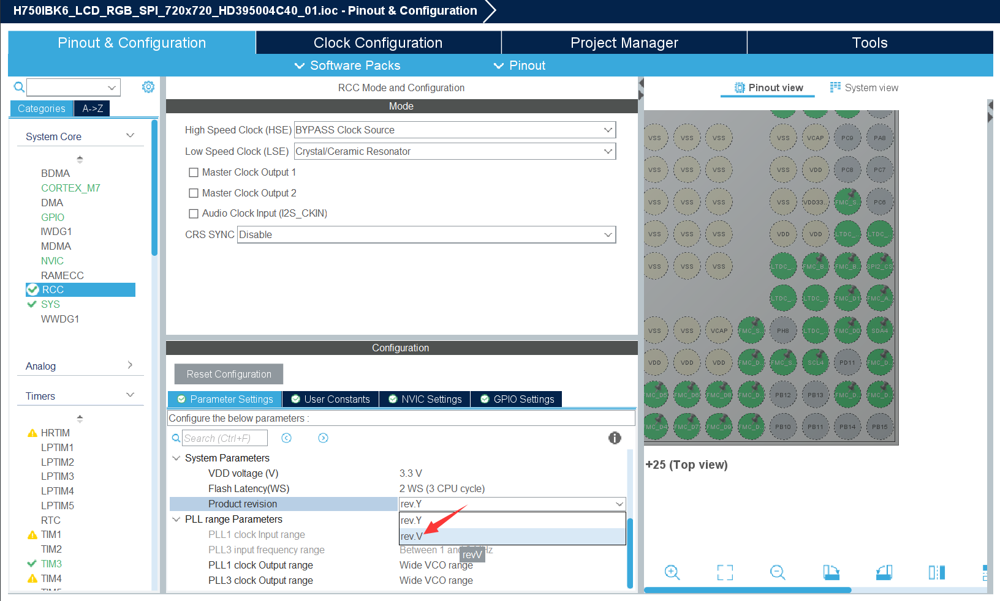
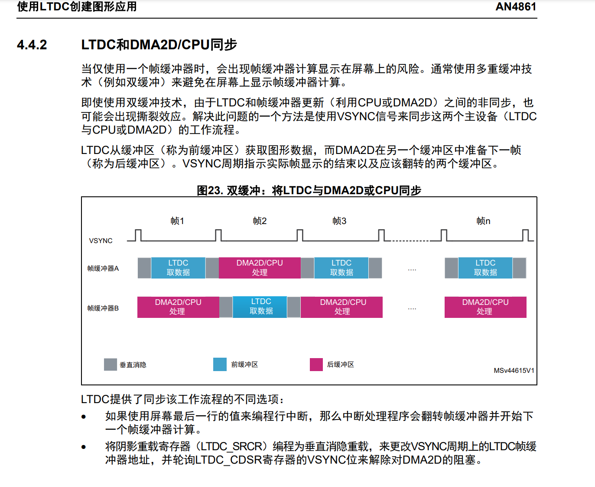
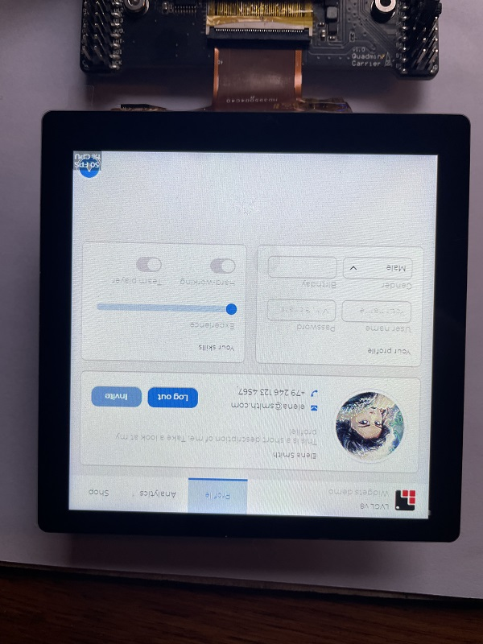
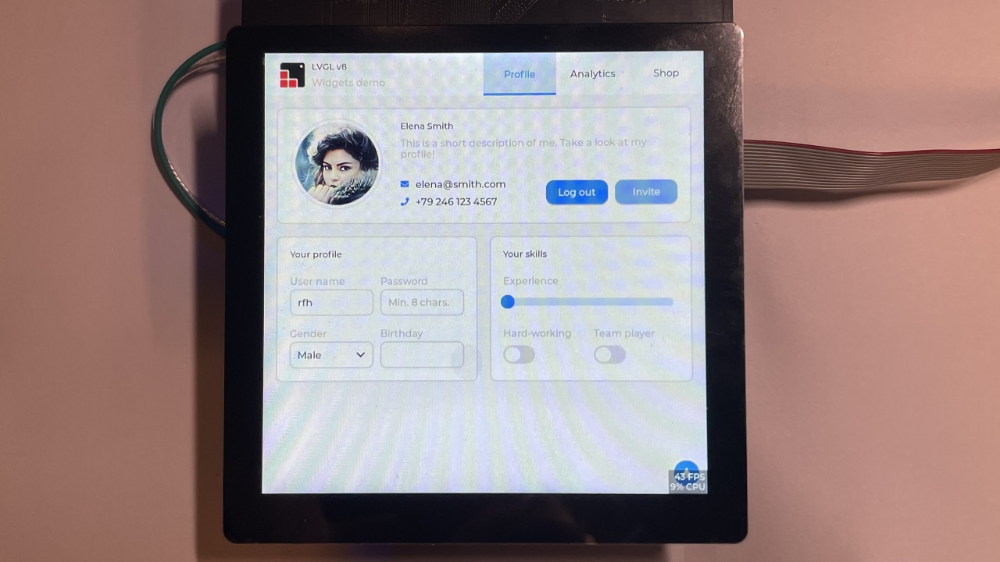
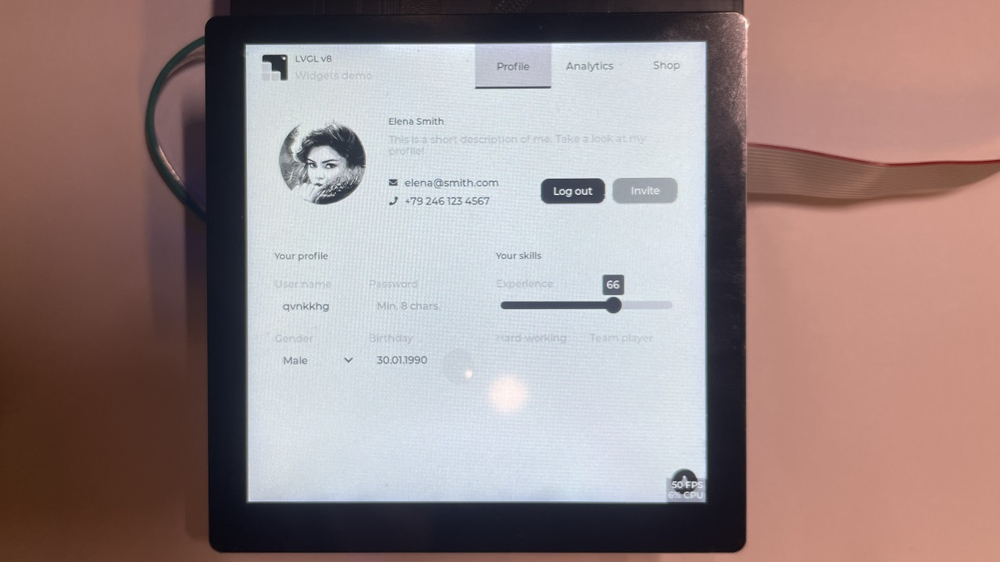
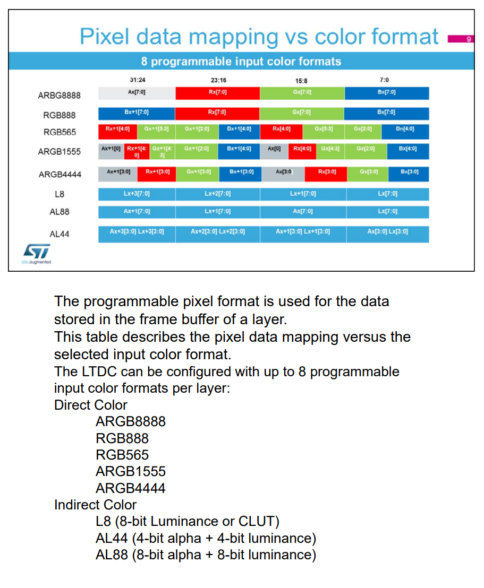
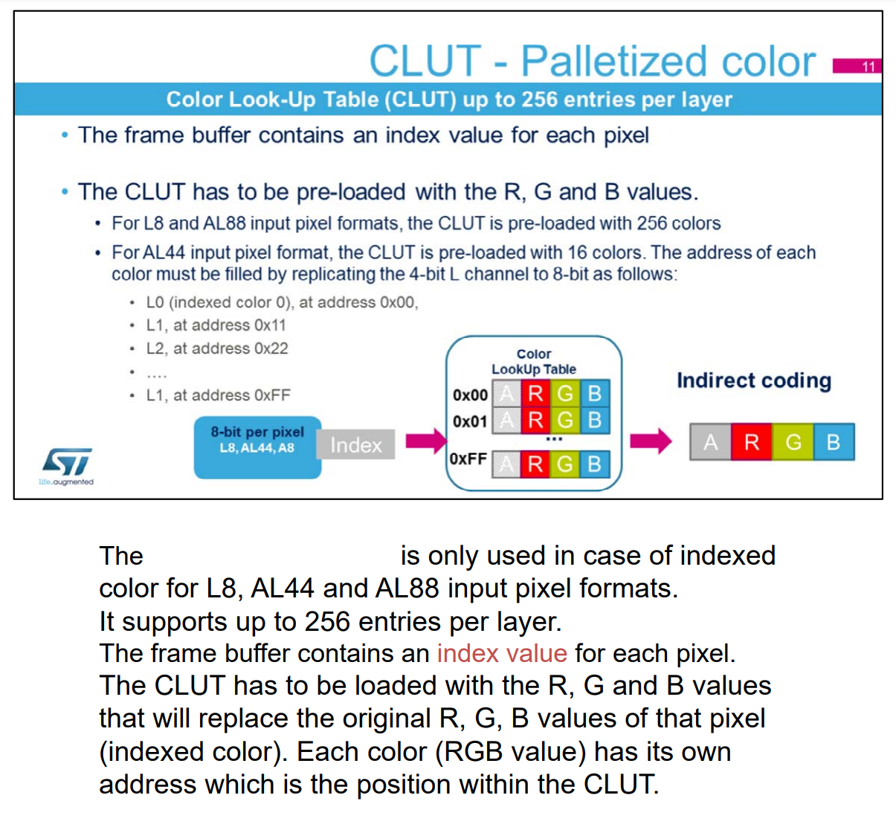
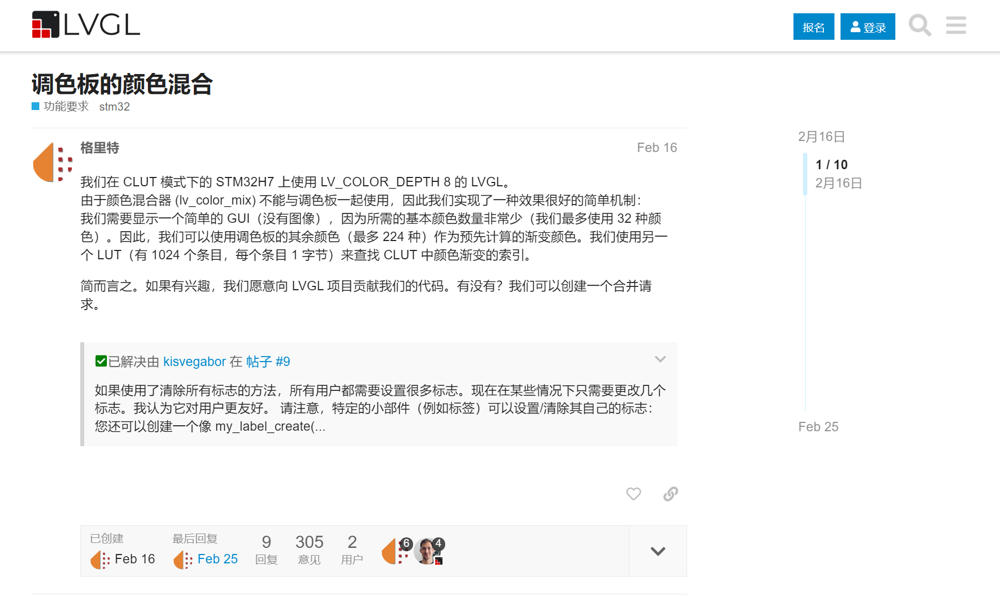

## H750IBK6_LCD_RGB_SPI_720x720_HD395004C40_01

> 2023/12/17 - 2023/12/18

## 配置信息

- CPU：主频 480MHz
- SDRAM：16位宽，时钟 120MHz
- 屏幕：720x720 RGB565，双缓冲垂直消隐切屏刷新，使用信号量同步 LTDC中断 和 disp_flush()
- LVGL：8.3版本
- RTOS：FreeRTOS + CMSIS v2 封装层

## CubeMX配置主频480MHz时报红叉？

[如何使用STM32CubeMX使STM32H7xx MCU的系统时钟达到480MHz？](https://community.st.com/t5/stm32-mcus/how-to-reach-480mhz-for-stm32h7xx-mcus/ta-p/49800)

[如果我们使用 480/4，那么 SDRAM 的频率为 120Mhz，但数据表显示 SDRAM 的最大频率为 100MHz！我们是否陷入以 60Mhz 运行 SDRAM 的困境？或者以 400Mhz 运行系统？](https://community.st.com/t5/stm32-mcus-products/stm32h7-max-sdram-clock-speed-for-480mhz/td-p/577931)

[STM32H743驱动32bit SDRAM最高时钟是100MHz，实际测试120MHz也可以，提供个参考设置案例](https://www.armbbs.cn/forum.php?mod=viewthread&tid=109144&fromuid=58)



## STM32 + LVGL 帧率提升策略 LTDC

[STM32 + LVGL 帧率提升策略 LTDC](https://www.bilibili.com/video/BV1nu41117Tx/?spm_id_from=333.337.search-card.all.click&vd_source=e6ad3ca74f59d33bf575de5aa7ceb52e)

## RGB屏闪屏问题

### 可能的硬件原因

背光元件不稳定，老化时间不够

### 可能的软件原因

- NV3052C 在 跑LVGL卡死时，若使用 30帧 LTDC 自刷新滤率，不论在O0还是O3编译优化时，全屏都会很快地明显闪烁，估计 RGB 时钟太低导致 每两帧间刷新时，显示残影的时间延长了，导致亮度变化

- NV3052C 在 跑LVGL卡死时，若使用 60帧 LTDC 自刷新滤率，在O0编译优化时，有轻微闪烁，在O3编译优化时，全屏没有肉眼可见闪烁，推测除了LTDC时钟设置满足60FPS，SDRAM带宽也要满足 CPU 绘图 + LTDC 自刷新带宽

## 双缓冲垂直消隐刷屏

### 该解决方案的优势

这是最高效地利用带宽刷屏方式，也是降低撕裂感的方式，因为这种方法的SDRAM带宽开销只有CPU向缓冲区绘制图形的写带宽，以及LTDC从缓冲区自刷新屏幕的读带宽，所以就不需要DMA2D搬运LVGL绘图缓冲区到LTDC自刷新缓冲区（这即消耗SDRAM读带宽，也消耗写带宽），那么DMA2D留着到需要刷图片和图层混合的时候解放CPU

详情可参考 AN4861 4.4.2



### 硬汉哥教程

[【实战技能】基于硬件垂直消隐的多缓冲技术在LVGL, emWin，GUIX和TouchGFX应用，含视频教程](https://www.armbbs.cn/forum.php?mod=viewthread&tid=120114)

- [bilibili视频讲解](https://www.bilibili.com/video/BV1rF411Q7A7/)

对于标志裸机可以用标志变量，RTOS必须要用信号量，硬汉的Demo是裸机方式，我是FreeRTOS得改成信号量

对于硬件双缓冲垂直消隐，硬汉哥配置的缓冲区是：

```c
/** LTDC 显存地址
  * void MX_LTDC_Init(void) 
  * pLayerCfg.FBStartAdress = LCD_MEM_ADDR;
  * 路径 C:\Users\PSA\Downloads\V7-6001_LVGL8 Template(V1.0)\User\bsp\src\bsp_tft_h7.c
/* 显存地址 */
pLayerCfg.FBStartAdress = LCDH7_FRAME_BUFFER;	// SDRAM 起始地址 0xC0000000，分配2MB给LTDC显存使用
#define LCDH7_FRAME_BUFFER		SDRAM_LCD_BUF1
/* LCD显存,第1页, 分配2M字节 */
#define SDRAM_LCD_BUF1 		EXT_SDRAM_ADDR
#define EXT_SDRAM_ADDR  	((uint32_t)0xC0000000)

/**
 * LVGL的双缓冲区，第一个缓冲区复用了 LTDC的显存，第二个缓冲区紧挨着第一个缓冲区，但 中断里也会切换 LTDC 的显存到第二个缓冲区
 * 路径：C:\Users\PSA\Downloads\V7-6001_LVGL8 Template(V1.0)\Project\MDK-ARM(AC5)\RTE\LVGL\lv_port_disp_template.c
 */
    /* Example for 3) also set disp_drv.full_refresh = 1 below*/
#elif defined Doublebuffering
    static lv_disp_draw_buf_t draw_buf_dsc_3; 
    static lv_color_t buf_3_1[MY_DISP_HOR_RES * MY_DISP_VER_RES] __MEMORY_AT(0xC0000000);  /*A screen sized buffer*/
    static lv_color_t buf_3_2[MY_DISP_HOR_RES * MY_DISP_VER_RES] __MEMORY_AT(0xC00BB800);  /*Another screen sized buffer*/

	lv_disp_draw_buf_init(&draw_buf_dsc_3, buf_3_1, buf_3_2,
							MY_DISP_VER_RES * MY_DISP_HOR_RES);   /*Initialize the display buffer*/
#endif
```

LTDC 行中断优先级，硬汉配置是 14

```c
// c:\Users\PSA\Downloads\V7-6001_LVGL8 Template(V1.0)\User\bsp\src\bsp_tft_h7.c
/* 使能行中断 */

HAL_NVIC_SetPriority(LTDC_IRQn, 0xE, 0);
HAL_NVIC_EnableIRQ(LTDC_IRQn);
```

需要找个地儿使能行中断：

```c
HAL_LTDC_ProgramLineEvent(&hltdc, LCD_T_VPW + LCD_T_VBP + LTC_T_VD);
```

只进入一次 HAL_LTDC_LineEventCallback 的问题

把 HAL 的 HAL_LTDC_IRQHandler(&hltdc); 注释掉，直接按照硬汉哥的，直接把这两行操作写在 LTDC_IRQHandler() 即可解决

```c
/**
  * @brief This function handles LTDC global interrupt.
  */
void LTDC_IRQHandler(void)
{
  /* USER CODE BEGIN LTDC_IRQn 0 */

  /* USER CODE END LTDC_IRQn 0 */
  //HAL_LTDC_IRQHandler(&hltdc);
  /* USER CODE BEGIN LTDC_IRQn 1 */
    HAL_LTDC_LineEventCallback(NULL);
  /* USER CODE END LTDC_IRQn 1 */
}

void HAL_LTDC_LineEventCallback(LTDC_HandleTypeDef *hltdc)
{
    LTDC->ICR = (uint32_t)LTDC_IER_LIE; // 清除中断标志

    /* 释放信号量 */
//    wTransferState = 1;
    osSemaphoreRelease(sem_ltdc_irq);
}
```

## 软件对运行帧率的影响因素

### LV_MEM_SIZE 动态内存空间不够

### 绘制的对象需要重绘的像素点多

### 运算量大

## 运行LVGL基准测试卡死的问题

我设置的64K运行会lv_demo_benchmark的Image示例屏幕会卡死：

```c

static scene_dsc_t scenes[] = {
......

//    {.name = "Image RGB",                    .weight = 20, .create_cb = img_rgb_cb},
//    {.name = "Image ARGB",                   .weight = 20, .create_cb = img_argb_cb},
//    {.name = "Image chorma keyed",           .weight = 5, .create_cb = img_ckey_cb},
//    {.name = "Image indexed",                .weight = 5, .create_cb = img_index_cb},
//    {.name = "Image alpha only",             .weight = 5, .create_cb = img_alpha_cb},
//
//    {.name = "Image RGB recolor",            .weight = 5, .create_cb = img_rgb_recolor_cb},
//    {.name = "Image ARGB recolor",           .weight = 20, .create_cb = img_argb_recolor_cb},
//    {.name = "Image chorma keyed recolor",   .weight = 3, .create_cb = img_ckey_recolor_cb},
//    {.name = "Image indexed recolor",        .weight = 3, .create_cb = img_index_recolor_cb},
//
//    {.name = "Image RGB rotate",             .weight = 3, .create_cb = img_rgb_rot_cb},
//    {.name = "Image RGB rotate anti aliased", .weight = 3, .create_cb = img_rgb_rot_aa_cb},
//    {.name = "Image ARGB rotate",            .weight = 5, .create_cb = img_argb_rot_cb},
//    {.name = "Image ARGB rotate anti aliased", .weight = 5, .create_cb = img_argb_rot_aa_cb},
//    {.name = "Image RGB zoom",               .weight = 3, .create_cb = img_rgb_zoom_cb},
//    {.name = "Image RGB zoom anti aliased",  .weight = 3, .create_cb = img_rgb_zoom_aa_cb},
//    {.name = "Image ARGB zoom",              .weight = 5, .create_cb = img_argb_zoom_cb},
//    {.name = "Image ARGB zoom anti aliased", .weight = 5, .create_cb = img_argb_zoom_aa_cb},
......
}
```

加大 lv_conf.h 的 LV_MEM_SIZE

[默认的 LV_MEM_SIZE 太小，无法完成运行基准测试 issue:3434](https://github.com/lvgl/lvgl/issues/3434)

但只加大这个 MEM SIZE 不行，还得指定 LVGL 在 H7 的哪块内存范围里动态分配内存，所以得指定内存池的起始地址（可以定义到H7的任意内存池地址）

```c
# define LV_MEM_ADR          0    
```

我觉得来个大手笔：把512K AXI SRAM 都给 LVGL

```c
#  define LV_MEM_SIZE    (512U * 1024U)          /*[bytes]*/

/*Set an address for the memory pool instead of allocating it as a normal array. Can be in external SRAM too.*/
#  define LV_MEM_ADR          0x24000000     /*0: unused*/
```

加大到512KB后，还是不能运行 Image 示例，算了，反正也不需要 LVGL 软件 PNG 或 JPG 解码，那么这个LVGL内存池可以改为 64KB 或硬汉的 100KB

```c

/*=========================
   MEMORY SETTINGS
 *=========================*/

/*1: use custom malloc/free, 0: use the built-in `lv_mem_alloc()` and `lv_mem_free()`*/
#define LV_MEM_CUSTOM      0
#if LV_MEM_CUSTOM == 0
/*Size of the memory available for `lv_mem_alloc()` in bytes (>= 2kB)*/
#  define LV_MEM_SIZE    (100U * 1024U)          /*[bytes]*/

/*Set an address for the memory pool instead of allocating it as a normal array. Can be in external SRAM too.*/
#  define LV_MEM_ADR          0     /*0: unused*/
    /*Instead of an address give a memory allocator that will be called to get a memory pool for LVGL. E.g. my_malloc*/
    #if LV_MEM_ADR == 0
        //#define LV_MEM_POOL_INCLUDE your_alloc_library  /* Uncomment if using an external allocator*/
        //#define LV_MEM_POOL_ALLOC   your_alloc          /* Uncomment if using an external allocator*/
    #endif

#else       /*LV_MEM_CUSTOM*/
#  define LV_MEM_CUSTOM_INCLUDE <stdlib.h>   /*Header for the dynamic memory function*/
#  define LV_MEM_CUSTOM_ALLOC     malloc
#  define LV_MEM_CUSTOM_FREE      free
#  define LV_MEM_CUSTOM_REALLOC   realloc
#endif     /*LV_MEM_CUSTOM*/

/*Number of the intermediate memory buffer used during rendering and other internal processing mechanisms.
 *You will see an error log message if there wasn't enough buffers. */
#define LV_MEM_BUF_MAX_NUM 16

/*Use the standard `memcpy` and `memset` instead of LVGL's own functions. (Might or might not be faster).*/
#define LV_MEMCPY_MEMSET_STD    0
```

[lvgl的内存管理函数的TLSF动态内存管理算法](https://blog.csdn.net/kelleo/article/details/122835525)

> lvgl的内存分配和释放提供了两套方案，可以通过lv_conf.h头文件中的宏LV_MEM_CUSTOM来控制使用哪个方案，
>
> 该宏定义值为0，则表示使用lvgl内置的内存分配函数lv_mem_alloc()和lv_mem_free()；
>
> 该宏定义值为1，则表示使用自定义“malloc()/free()/realloc()”
>
> [LiteOS内存管理：TLSF算法](https://www.jianshu.com/p/01743e834432)

## 18bit 模式接 16bit LTDC LVGL 图片显示异常问题

这种情况在 LTDC 时钟设置为 18MHz 自刷新率为30FPS时会出现，把时钟改回 36MHz 使自刷新率提升到 60FPS左右，此现象消失

发送 0x3A 命令调戏 NV3052c 是没有用的！

| LVGL图片过渡有亮线                                   | NV3052 0x3A命令设置16bit显示颜色还是不对（默认是18bit）      |
| ---------------------------------------------------- | ------------------------------------------------------------ |
|  |  |

这是一种时序问题，有个类似的BUG排查记录很详细，也是时序问题：[痞子衡嵌入式：记录i.MXRT1060驱动LCD屏显示横向渐变色有亮点问题解决全过程（提问篇）](https://www.cnblogs.com/henjay724/p/12602979.html) 

## GT911触摸芯片驱动适配

### 第1步：魔改Arduino驱动库

将 [gt911-arduino](https://github.com/TAMCTec/gt911-arduino) 驱动库使用 `FRToSI2C  `的 `readWord() readWords() writeWord() writeWords()` 替换` Arduino I2C API`

> 注意：GT911寄存器地址是`16bit`的, `FRToSI2C  `的 `readWord() readWords() writeWord() writeWords()` 是读写16位寄存器地址的函数

我舍弃了GT911的复位时序函数，因为我板子把GT911的复位引脚和NV3052屏幕驱动芯片的复位引脚接一起了，所以GT911就跟着NV3052c的复位时序一起复位好了，这样复位下GT911的 7bit I2C 地址是 `0x5D`

### 第2步：实现LVGL触摸接口

在`Bsp/hal_stm_lvgl/touchpad/touchpad.cpp`实现回调函数`touchpad_read()`注册到 lvgl 即可

### 测试：5点触摸

这是我有史以来测试过的最灵敏的5点触摸G+FF结构的触摸屏

单点坐标在 `(0, 0), (0, 720), (720, 0), (720, 720)` 的触摸区域内检测十分准确

两个点的坐标区分得很好，但两个触摸点离得太近时会识别为一个点（约小于5mm）

```c
Touch 1 :  x: 124  y: 196  size: 12
Touch 2 :  x: 684  y: 8  size: 13
Touch 3 :  x: 84  y: 662  size: 15
Touch 4 :  x: 646  y: 619  size: 13
Touch 5 :  x: 291  y: 417  size: 16
Touch 1 :  x: 124  y: 196  size: 12
Touch 2 :  x: 684  y: 8  size: 13
Touch 3 :  x: 84  y: 662  size: 15
Touch 4 :  x: 646  y: 619  size: 13
Touch 5 :  x: 291  y: 417  size: 16
Touch 1 :  x: 124  y: 196  size: 12
Touch 2 :  x: 684  y: 8  size: 13
Touch 3 :  x: 84  y: 662  size: 15
Touch 4 :  x: 646  y: 619  size: 13
Touch 5 :  x: 291  y: 417  size: 16
```

### 使用时应注意的地方

GT911 轮询模式周期不能低于10ms，超时了也不行，能读出十几个触摸坐标乱码

## 测试LVGL控件：RGB色轮

[拾色器 | Color wheel (lv_colorwheel)](https://docs.lvgl.io/8.3/widgets/extra/colorwheel.html?highlight=wheel)

> 设置弧形宽度 [LVGL 之 Arc 控件介绍](https://www.wpgdadatong.com.cn/blog/detail/46125)
>
> ```c
> void my_arc_test(void)
> {
>  /*Create an Arc*/
>  lv_obj_t* arc = lv_arc_create(lv_scr_act());
> 
>  lv_obj_set_style_arc_color(arc, lv_palette_darken(LV_PALETTE_BLUE_GREY, 3), LV_PART_MAIN | LV_STATE_DEFAULT);  //背景弧形颜色
>  lv_obj_set_style_arc_color(arc, lv_palette_lighten(LV_PALETTE_CYAN, 2), LV_PART_INDICATOR | LV_STATE_DEFAULT);  //前景弧形颜色
>  lv_obj_set_style_arc_width(arc, 40, LV_PART_MAIN | LV_STATE_DEFAULT);  //背景弧形宽度
>  lv_obj_set_style_arc_width(arc, 40, LV_PART_INDICATOR | LV_STATE_DEFAULT);  //前景弧形宽度
> 
>  lv_obj_set_size(arc, 300, 300);
>  lv_arc_set_rotation(arc, 135);
>  lv_arc_set_bg_angles(arc, 0, 270);
>  //lv_arc_set_bg_angles(arc, 135, 45);
>  lv_arc_set_value(arc, 40);
>  lv_obj_center(arc);
> }
> ```

## LVGL综合示例测试

### O3鸡血优化

测试视频：[LVGL综合示例测试O3鸡血优化.mp4](https://github.com/oldgerman/workspace_H7/blob/master/H750IBK6_LCD_RGB_SPI_720x720_HD395004C40_01/Images/LVGL综合示例测试O3鸡血优化.mp4)



GT911 + lv_demo_widgets 联动正常

静止时43FPS，触摸影响屏幕图案时 27~33FPS

GT911 5点坐标实时输出：

```shell
Touch 1 : x: 688  y: 0  size: 10
Touch 2 : x: 50  y: 691  size: 12
Touch 3 : x: 622  y: 584  size: 9
Touch 4 : x: 177  y: 151  size: 18
Touch 5 : x: 421  y: 227  size: 9
Touch 1 : x: 688  y: 0  size: 10
Touch 2 : x: 50  y: 691  size: 12
Touch 3 : x: 622  y: 584  size: 9
Touch 4 : x: 177  y: 151  size: 18
Touch 5 : x: 421  y: 227  size: 9
```

栈信息（浏览所有LVGL页面后查看）：

```shell
$ISR_STACK
ISR Stack : 50/256  19%

$TASK_STACK
commTask : 57/128  44%
UsbServerTask : 355/512  69%
usbIrqTask : 37/128  28%
ledTask : 556/1024  54%
```

CPU利用率（屏幕静置状态）：

```shell
$CPU_INFO
---------------------------------------------
任务名 任务状态 优先级 剩余栈 任务序号
UsbServerTask                  	X	32	157	6
IDLE                           	R	0	108	3
commTask                       	B	24	71	5
ledTask                        	B	8	550	7
Tmr Svc                        	B	2	219	4
usbIrqTask                     	B	32	91	1
---------------------------------------------
任务名 运行计数 使用率
UsbServerTask                  	9		<1%
IDLE                           	357456		81%
ledTask                        	43520		9%
commTask                       	0		<1%
usbIrqTask                     	0		<1%
Tmr Svc                        	0		<1%
---------------------------------------------
```

### O0优化

帧数打对折有余

### BUG（已解决）

问题现象：fibre 通信崩了，USB发送命令LVGL就卡死且不回复，但USB仅打印GT911的五点坐标正常

调试信息：在执行`FreeRTOS`函数`uxListRemove()`时，进`hardfault()`，故障分析器报非对齐访问错误

问题原因：`lv_task_handler()`所在的任务`ledTask`任务栈空间太小，从 8KB 加大到 16KB 此现象消失

## LTDC自刷新带宽测试

两个显示缓冲区在 SDRAM1 的 BANK0 和 BANK1 起始地址 1MB

### O3优化，主频 480MHz，FMC 200MHz，SDRAM 100MHz

```c
测试SDRAM1: 
*****************************************************************************************************
进行速度测试>>>
以16位数据宽度写入数据，大小：32 MB，耗时: 290 ms, 写入速度：110.34 MB/s
读取数据完毕，大小：32 MB，耗时: 406 ms, 读取速度：78.82 MB/s
*****************************************************************************************************

测试SDRAM2: 
*****************************************************************************************************
进行速度测试>>>
以16位数据宽度写入数据，大小：32 MB，耗时: 329 ms, 写入速度：97.26 MB/s
读取数据完毕，大小：32 MB，耗时: 2315 ms, 读取速度：13.82 MB/s
*****************************************************************************************************
```

测试 SDRAM1 读写时，屏幕变成SDRAM中读写测试的数据了，花花绿绿的


测试 SDRAM2 读写时，LVGL的图像又重新显示在屏幕上，但SDRAM2读速度只有 13.82MB/s，因为与此同时LTDC还在抢占SDRAM带宽资源，粗算一下 LTDC 强站带宽：78.82-13.82=65MB/s，与计算的 720x720 16bit 自刷新 60Hz 带宽 59MB/s 接近

### O3优化，主频 480MHz，FMC 240MHz，SDRAM 120MHz

```
测试SDRAM1: 
*****************************************************************************************************
进行速度测试>>>
以16位数据宽度写入数据，大小：32 MB，耗时: 216 ms, 写入速度：148.15 MB/s
读取数据完毕，大小：32 MB，耗时: 323 ms, 读取速度：99.07 MB/s
*****************************************************************************************************

测试SDRAM2: 
*****************************************************************************************************
进行速度测试>>>
以16位数据宽度写入数据，大小：32 MB，耗时: 252 ms, 写入速度：126.98 MB/s
读取数据完毕，大小：32 MB，耗时: 1875 ms, 读取速度：17.07 MB/s
*****************************************************************************************************
```

测试 SDRAM1 和 SDRAM2 读写时显示效果同上

SDRAM2读速度只有 17.07MB/s，粗算一下 LTDC 强站带宽：99.07-17.07=82MB/s，大于计算的 720x720 16bit 自刷新 60Hz 带宽 59MB/s 

## LTDC使用8位色

### 测试 LVGL 8位色

ltdc.c 使用 L8颜色LTDC_PIXEL_FORMAT_L8，

```
pLayerCfg.PixelFormat = LTDC_PIXEL_FORMAT_L8;
```

lv_conf.h 设置 LVGL 色深 8bpp，关闭 DMA2D

```c
#define LV_COLOR_DEPTH          8    // 实际上转换为RGB232，不是CLUT索引色
#define LV_USE_GPU_STM32_DMA2D  0
```

编译后缓冲区大小减一半，每个 506KB

SDRAM 120MHz，帧数没有提升，SDRAM1 读带宽变多（从 99 增加到 117MB/s）

```
测试SDRAM1: 
*****************************************************************************************************
进行速度测试>>>
以16位数据宽度写入数据，大小：32 MB，耗时: 174 ms, 写入速度：183.91 MB/s
读取数据完毕，大小：32 MB，耗时: 272 ms, 读取速度：117.65 MB/s
*****************************************************************************************************
测试SDRAM2: 
*****************************************************************************************************
进行速度测试>>>
以16位数据宽度写入数据，大小：32 MB，耗时: 208 ms, 写入速度：153.85 MB/s
读取数据完毕，大小：32 MB，耗时: 1578 ms, 读取速度：20.28 MB/s
*****************************************************************************************************
```



[TM32F7_Peripheral_LTDC.pdf](https://www.st.com/resource/en/product_training/STM32F7_Peripheral_LTDC.pdf)

|  |  |
| ------------------------------------------------ | ------------------------------------------------------------ |

[STM32H7的8位色CLUT，Lookup Table颜色表生成方法](https://www.armbbs.cn/forum.php?mod=viewthread&tid=96645&extra=page%3D1)

> 硬汉这个帖子没有示例
>

LVGL 储存库合并请求似乎支持了H7 CLUT功能：[Color mixing for a color palette - Feature request](https://forum.lvgl.io/t/color-mixing-for-a-color-palette/10946)

似乎没找到示例，这个以后有空研究



