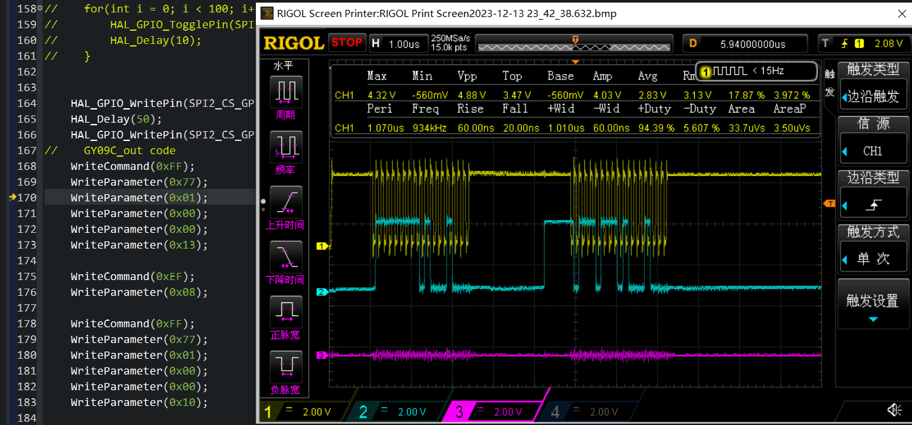

## H750IBK6_LCD_RGB_TL034WVS05_01

在 H750IBK6_SDRAM_01 工程的基础上加入冠显光电RGB屏 [TL034WVS05-B1477A](https://www.adafruit.com/product/5825) 测试 Demo

## 参考

- [Adafruit：Square RGB TTL TFT Display - 3.4" 480x480 No Touchscreen - TL034WVS05-B1477A](https://www.adafruit.com/product/5825)

  > ## Technical Details
  >
  > - [Display Init Code Listing](https://cdn-shop.adafruit.com/product-files/5825/C19625-001+1477_code.txt)
  > - [Display Spec Sheet](https://cdn-shop.adafruit.com/product-files/5825/Specification_TL034WVS05-B1477A.pdf)
  > - [ST7701 Datasheet](https://cdn-shop.adafruit.com/product-files/5825/ST7701+Datasheet.pdf)
  
- [ST7701芯片820*320屏幕移植stemwin](https://blog.csdn.net/qq_40831436/article/details/125770221)

- [捡屏幕第一弹——5寸480x854 ST7701屏](https://www.nxpic.org.cn/module/forum/thread-622198-1-1.html)

  > 该文中提到的 Github ST7701s 初始化代码的 仓库应该是 [yd03/sdk/driver/itp/itp_screen.c](https://github.com/tomyqg/yd03/blob/f471fceec1f7ea7ff51633583bbc0fb4e8583ae2/sdk/driver/itp/itp_screen.c#L278)

## ST7701 配置

### 9bit SPI

厂家屏幕模组的手册时序图就是坑爹的，得看 ST7701S 芯片的时序图，这货是 9bit SPI，比 8bit 多的一个位表示读写，0是命令，1是数据

> ST7701被配置为9位SPI。第一位区分命令与数据，CPOL、CPHA都是1

开始体现 H7 SPI 的强大之处，支持 4bit 到 32bit (1bit 步进)任意长度的 SPI，配置成 9bit 即可

实现写命令和写数据的两个函数：

```c
void WriteCommand(uint16_t data)
{
    data = data | 0x000; // bit[8]: 0 表示写命令

    if(HAL_SPI_Transmit(&hspi2, (uint8_t *)(&data), 1, HAL_MAX_DELAY) != HAL_OK)
    //                                              ^ 对于 9bit 硬件 SPI 传输长度取 1 ，不要写 2
    {
        Error_Handler();
    }
}

void WriteParameter(uint16_t data)
{
    data = data | 0x100; // bit[8]: 1 表示写数据

    if(HAL_SPI_Transmit(&hspi2, (uint8_t *)(&data), 1, HAL_MAX_DELAY) != HAL_OK)
    //                                              ^ 对于 9bit 硬件 SPI 传输长度取 1 ，不要写 2
    {
        Error_Handler();
    }
}
```

这里有个坑爹点，HAL_SPI_Transmit 的参数3 ——Size：给 1，而不是 2

> 抓下波试试，黄色波形是 SPI2_SCK，蓝色波形是 SPI2_MOSI
>
> ### Size 给 2 
>
> 断点处写命令0xFF、写数据0x77 的两段波形
>
> 可以看到每段 SCK 信号周期数为 18，每段波形的前9bit是想要产生的信号，后9bit是没有意义的信号
>
> 
>
> ### Size 给 1 
>
> 断点处写命令0xFF、写数据0x77 的两段波形
>
> 可以看到每段 SCK 信号周期数为 9
>
> 这个就是想要的 9bit 硬件 SPI :happy:
>
> 

### CS片选信号

只需要在那一长串初始化命令代码最前面和最后面配置即可：

参考： [yd03/sdk/driver/itp/itp_screen.c](https://github.com/tomyqg/yd03/blob/f471fceec1f7ea7ff51633583bbc0fb4e8583ae2/sdk/driver/itp/itp_screen.c#L278) 的 ST7701_PanelInitialCode() 函数：即使片选拉低后，发送命令和数据中途有几次调用延迟函数，也不影响

```c
void ST7701_PanelInitialCode(void)
{

    // 控制复位引脚
    LCD_Nreset (1);
    usleep (10000);           //!< 延迟函数 100us
    LCD_Nreset (0);
    usleep (10000);           //!< 延迟函数 100us
    LCD_Nreset (1);
    usleep (120*1100);           //!< 延迟函数 120ms，复位后必须等待至少120ms
    
    // 片选拉低
    ithGpioClear(CFG_GPIO_LCD_CS);
    
    // 写命令和数据
    St7701_WriteCommand(0x11);
    usleep (120*1000);           //!< 延迟函数
    St7701_WriteCommand(0xFF);
    St7701_WriteData(0x77);
    St7701_WriteData(0x01);
    St7701_WriteData(0x00);
......
    St7701_WriteCommand(0xD0);
    St7701_WriteData(0x88);
    usleep(120*1000);             //!< 延迟函数
    St7701_WriteCommand(0xEF);
    St7701_WriteData(0x08);
    St7701_WriteData(0x08);
    St7701_WriteData(0x08);
    St7701_WriteData(0x45);
    St7701_WriteData(0x3F);
    St7701_WriteData(0x54);
    usleep(100*1000);           //!< 延迟函数
    St7701_WriteCommand(0xE0);
    St7701_WriteData(0x00);
    St7701_WriteData(0x00);
    St7701_WriteData(0x02);
......
    St7701_WriteCommand(0xFF);
    St7701_WriteData(0x77);
    St7701_WriteData(0x01);
    St7701_WriteData(0x00);
    St7701_WriteData(0x00);
    St7701_WriteData(0x00);
    usleep(120*1000);           //!< 延迟函数
    St7701_WriteCommand(0x29);
    usleep(30*1000);            //!< 延迟函数

    // 片选拉低高
    ithGpioSet(CFG_GPIO_LCD_CS);

}
```

