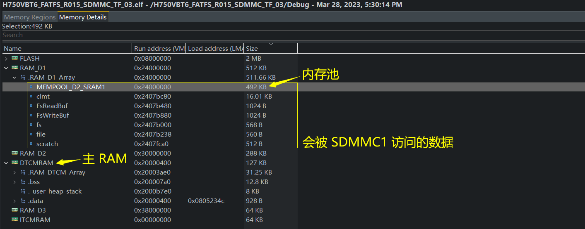
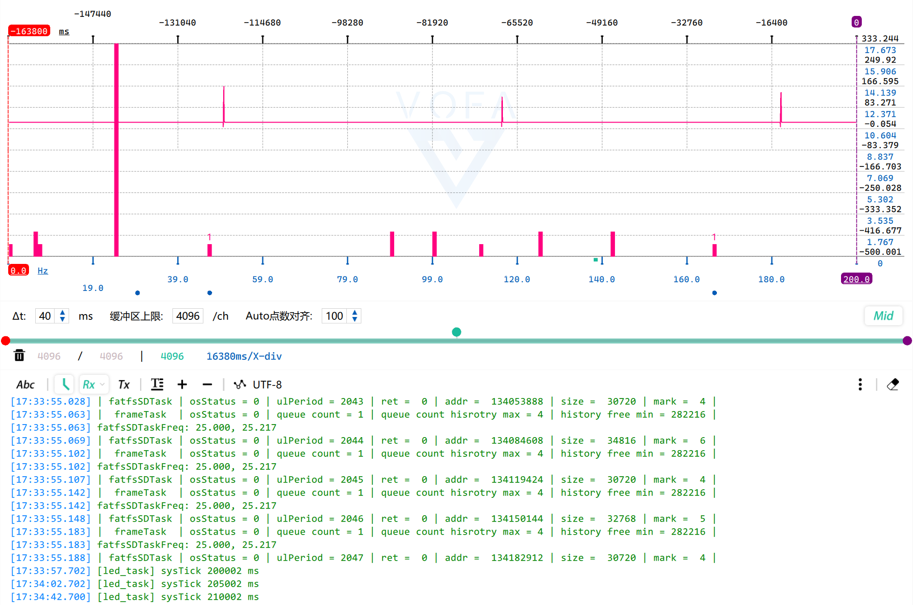
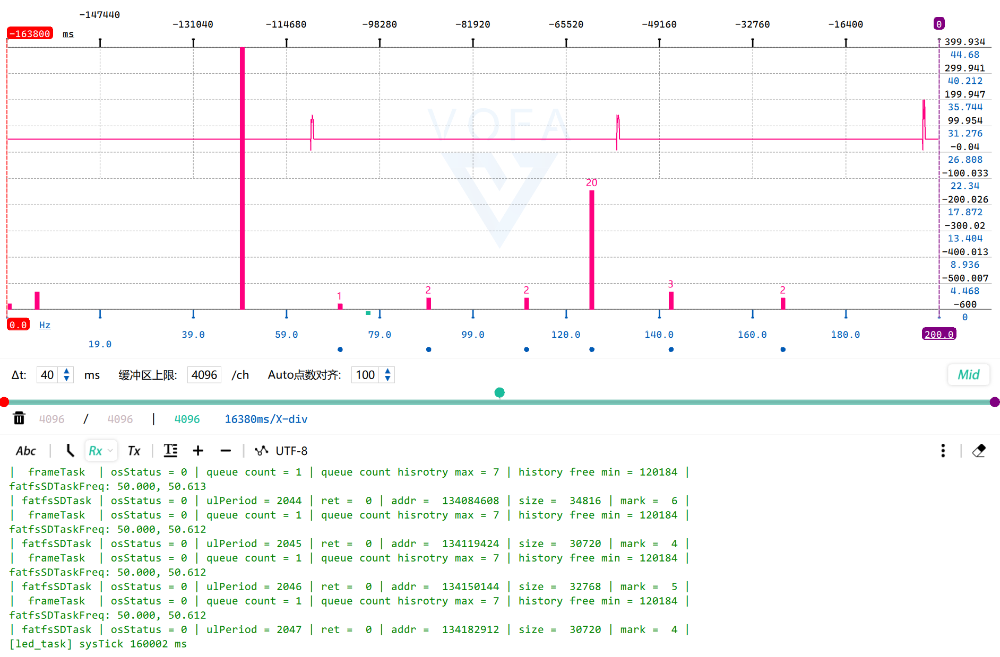
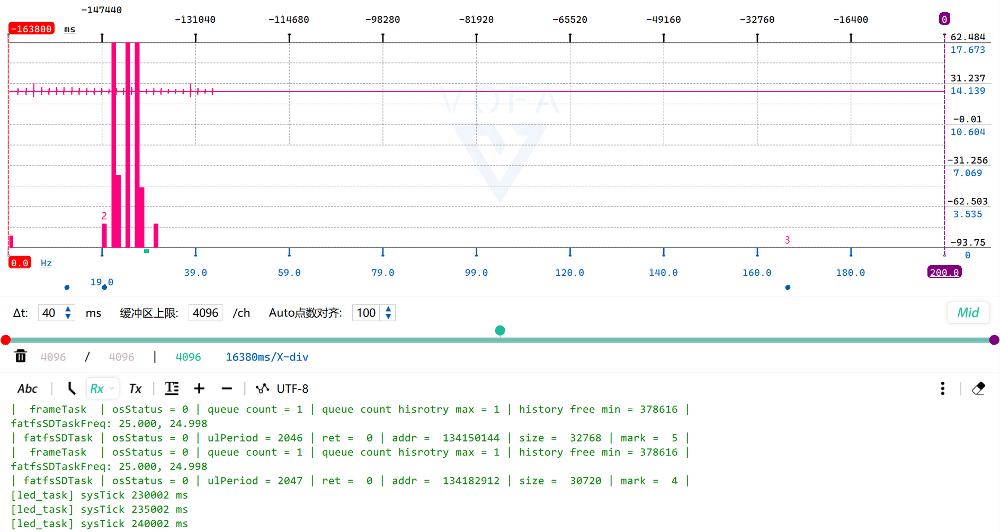
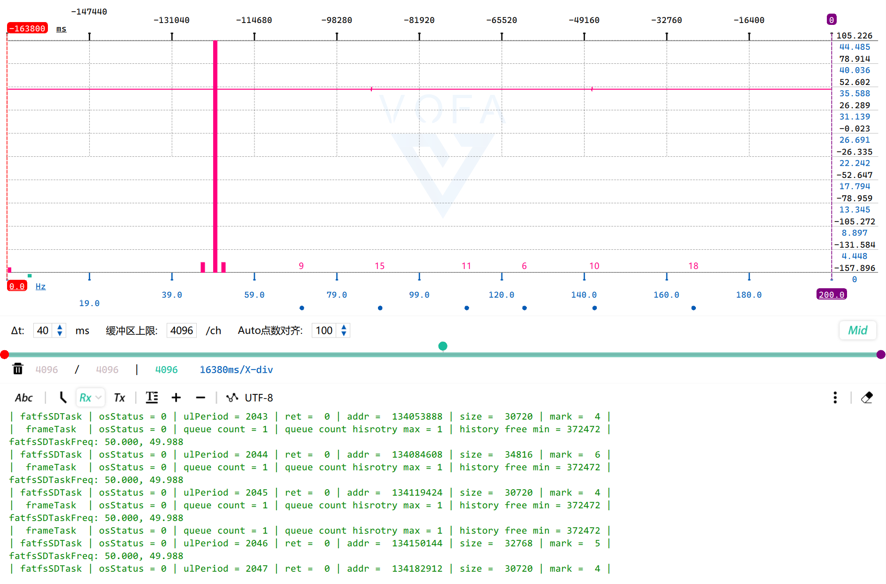
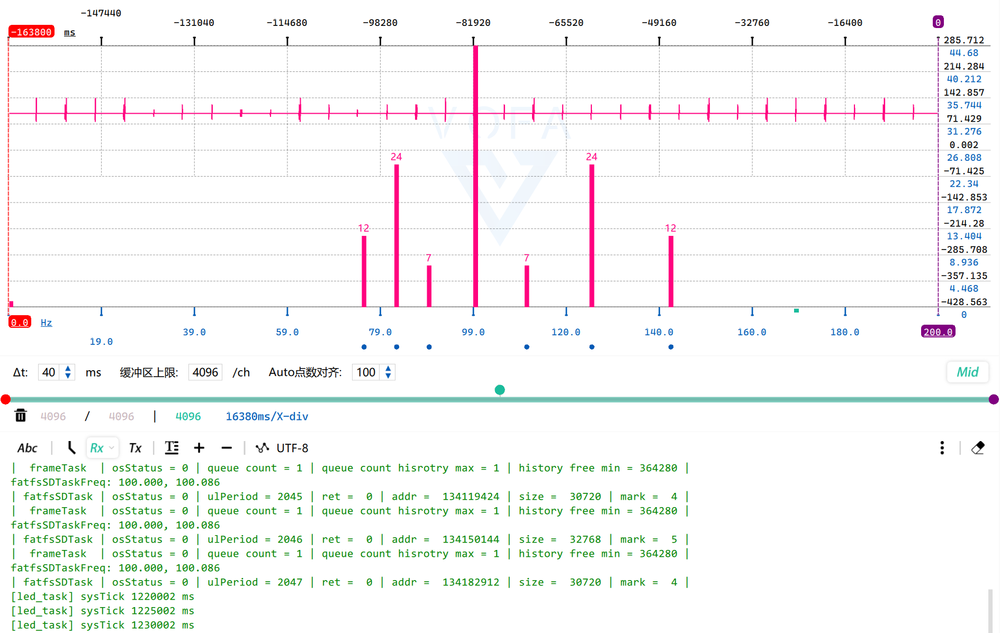
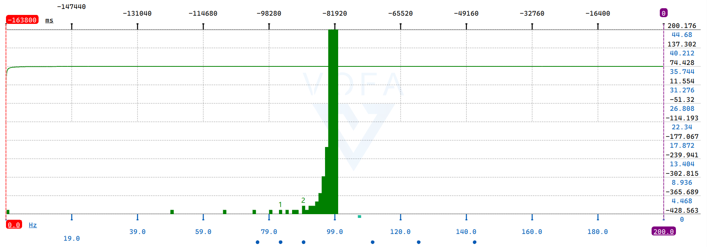
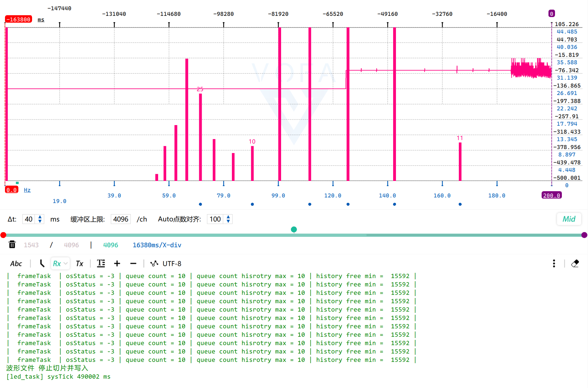

## H750VBT6_FATFS_R015_SDMMC_TF_03

> 创建日期：2023-03-27

## 关于

用于 [H750VBT6_FATFS_R015_SDMMC_TF_02](https://github.com/oldgerman/workspace_H7/tree/master/H750VBT6_FATFS_R015_SDMMC_TF_02) 工程的下阶段测试

关键内存分布：



## 帧处理任务 与 FASFS+SD卡任务 之间的消息队列通信

### 参考

- [FreeRTOS消息队列——xiaojie0513](https://shequ.stmicroelectronics.cn/thread-619700-1-1.html)

  > **3.写阻塞**
  >
  > 与读阻塞想反，任务也可以在写队列时指定一个阻塞超时时间。这个时间是**当被写队列已满时，任务进入阻塞态**以等待队列空间有效的最长时间。
  >
  > > 阻塞态（Blocked） ：由于等待信号量，消息队列，事件标志组等而处于的状态被称之为阻塞态，任务调用延迟函数也会处于阻塞态。—— Armfly V5 FreeRTOS P146
  >
  > 由于队列可以被多个任务写入，所以对单个队列而言，也可能有多个任务处于阻塞状态以等待队列空间有效。这种情况下，一旦队列空间有效，只会有一个任务会被解除阻塞，这个任务就是所有等待任务中优先级最高的任务。而如果所有等待任务的优先级相同，那么被解除阻塞的任务将是等待最久的任务。

### 存取消息时发生了什么？

假设 RTOS 对象情况如下：

- frameProcessorTask（帧处理器任务）是 RealTime 优先级，向消息队列放数据，每秒固定频率执行（取 25Hz，每 40 ms 系统时间戳被调度一次）
- fatfsSDTask（FATFS SD卡任务）是 Normal 优先级，从消息队列取数据，需要消息队列里有消息才会解除阻塞态，然后在运行态时从消息队列取数据（由事件驱动）
- 消息队列采用 FIFO 方式的存取
- 有 3 个写入 SD 卡的缓冲区（3 个看作一个循环缓冲区）分别对应三种消息：msg_write_buf_1、msg_write_buf_2、msg_write_buf_3，frameProcessorTask 每次调用会循环发送这三种消息

用表格当作时序图模拟一波运行过程：

| frameProcessorTask | frameProcessorTask | fatfsSDTask      | fatfsSDTask        | msg_queue                                         | msg_queue        |
| ------------------ | ------------------ | ---------------- | ------------------ | ------------------------------------------------- | ---------------- |
| 调度时间戳（ms）   | 放数据             | 调度时间戳（ms） | fatfsSDTask 取数据 | 剩余的消息                                        | 剩余的消息个数   |
| 40                 | msg_write_buf_1    |                  |                    | msg_write_buf_1                                   | 1                |
|                    |                    | 42               | msg_write_buf_1    |                                                   | 0                |
| 80                 | msg_write_buf_2    |                  |                    | msg_write_buf_2                                   | 1                |
| 120                | msg_write_buf_3    |                  |                    | msg_write_buf_3、msg_write_buf_2                  | 2                |
|                    |                    | 122              | msg_write_buf_2    | msg_write_buf_3                                   | 1                |
| 160                | msg_write_buf_1    |                  |                    | msg_write_buf_1、msg_write_buf_3                  | 2                |
| 200                | msg_write_buf_2    |                  |                    | msg_write_buf_2、msg_write_buf_1、msg_write_buf_3 | 3 **消息队列满** |
|                    |                    | 202              | msg_write_buf_3    | msg_write_buf_2、msg_write_buf_1                  | 2                |
|                    |                    | 222              | msg_write_buf_1    | msg_write_buf_2                                   | 1                |
| 240                | msg_write_buf_3    |                  |                    | msg_write_buf_3、msg_write_buf_2                  | 2                |
|                    |                    | 262              | msg_write_buf_2    | msg_write_buf_3                                   | 1                |
| 280                | msg_write_buf_1    |                  |                    | msg_write_buf_1、msg_write_buf_3                  | 2                |
|                    |                    | 292              | msg_write_buf_3    | msg_write_buf_1                                   | 1                |
|                    |                    | 302              | msg_write_buf_1    |                                                   | 0                |
| 320                | msg_write_buf_2    |                  |                    | msg_write_buf_2                                   | 1                |
| 360                | msg_write_buf_3    |                  |                    | msg_write_buf_3、msg_write_buf_2                  | 2                |
| ...                | ...                | ...              | ...                | ...                                               | ...              |

### 消息队列参数的约束

消息队列的深度取多大？比较特殊：

- 消息队列深度不能超过写入SD卡缓冲区的个数，若超过了，当消息队列满时，例如消息队列里有 msg_write_buf_1、2、3、1，就会发生重复写入两次 1 号缓冲区的数据

消息队列的存放函数超时等待时间给多大？比较特殊：

- 在本工程中，我一开始认为永远不能让消息队列存满，后来应该是可以存满的，但需要保证 存放消息的等待时间 + 本次任务运行到此的时间 < 任务的绝对调度周期，这个等待的时间可能需要动态调整（暂未写到代码中）

  > ```c
  > static void frameProcessorTask(void* argument)
  > {
  > 
  > 	TickType_t xLastWakeTime;
  > 	TickType_t xTaskPeriod;
  > 	xLastWakeTime = xTaskGetTickCount();	/* 获取当前的系统时间 */
  > 	TickType_t xTimeStampStartFun;     // 任务函数被调度时在for(;;)最开始记录的时间戳
  >  TickType_t xTimeStampBeforePutMsg; // 存放消息队列之前的时间戳
  >  TickType_t xTimeStampOffset = 1;  // 时间偏移，这个值需要看情况调整
  >  bool isMsgQueueOverflow;  // 标记消息队列是否溢出
  > 
  > 	for (;;)
  > 	{
  >      /* 进入函数立即保存时间戳 */
  >      xTimeStampStartFun = xTaskGetTickCount();
  > 
  >      /* 数据处理 */
  >      ... 
  > 
  > 		xTaskPeriod = 1000 / frame_freq;	/* 调度周期，单位ms */
  >       /* 结束函数保存时间戳 */
  >       xTimeStampBeforePutMsg = xTaskGetTickCount();
  >      /* 向消息队列存放缓冲区的消息，并判断是否成功在给定时间内将消息放入队列 */
  >      if(osMessageQueuePut(	osMessageQueueId_t 	mq_id,
  >          const void * msg_ptr,
  >          uint8_t      msg_prio,
  >          uint32_t     timeout //写阻塞时间 给 xTaskPeriod - (xTimeStampBeforePutMsg - xTimeStampStartFun) - xTimeStampOffset  当被写队列已满时，存放消息的任务进入阻塞态等待队列空间的最长时间
  >      	) == osErrorTimeout) {
  >          isMsgQueueOverflow = true; //消息队列溢出
  >          printf("消息队列溢出\r\n");
  >     }
  >       /* 等待绝对时间的下次调度 */
  > 		vTaskDelayUntil(&xLastWakeTime, xTaskPeriod);
  > 	}
  > };
  > ```
  >
  > 若写等待时间到了，消息队列还是满的，就会发生消息队列被覆盖写入
  >
  > **osMessageQueuePut** 可能的 **osStatus_t** 返回值：
  >
  > - osOK：消息已放入队列。
  > - osErrorTimeout：无法在给定时间内将消息放入队列（等待时间语义）。
  > - osErrorResource：队列中空间不足（尝试语义）。
  > - osErrorParameter：参数mq_id为NULL或无效，ISR 中指定的非零超时。
  >
  > ```c
  > /// Status code values returned by CMSIS-RTOS functions.
  > typedef enum {
  >   osOK                      =  0,         ///< Operation completed successfully.
  >   osError                   = -1,         ///< Unspecified RTOS error: run-time error but no other error message fits.
  >   osErrorTimeout            = -2,         ///< Operation not completed within the timeout period.
  >   osErrorResource           = -3,         ///< Resource not available.
  >   osErrorParameter          = -4,         ///< Parameter error.
  >   osErrorNoMemory           = -5,         ///< System is out of memory: it was impossible to allocate or reserve memory for the operation.
  >   osErrorISR                = -6,         ///< Not allowed in ISR context: the function cannot be called from interrupt service routines.
  >   osStatusReserved          = 0x7FFFFFFF  ///< Prevents enum down-size compiler optimization.
  > } osStatus_t;
  > ```

## FATFS 发送缓冲区无法使用 RAM_D2

排查了好久，百思不得其解，最后发现原因是 开发板 使用的 SDMMC1 控制器的 IDMA 只能访问 RAM_D1（AXI SRAM）！我却想着画的板子用的 SDMMC2... 看安富莱V7的教程时还特别标出了，实际测试时又忘了：


## 测试（闪迪64G Ultra）

闪迪 64G Ultra 格式化为 FAT32 + 64KB 簇大小，在格式化后写入几十G后，才进行下列测试

### 层链表信息

| 层编号 | 瓦片大小 | 瓦片缓冲区大小 | 瓦片缓冲区地址 | 缓冲区大小 | 缓冲区发送周期 | DRAM 当前共使用 | DRAM 当前剩余 | DRAM 历史最少可用 |
| ------ | -------- | -------------- | -------------- | ---------- | -------------- | --------------- | ------------- | ----------------- |
| 0      | 1        | 2048           | 0x240005e0     | 4096       | 2048           | 3592            | 500216        | 500216            |
| 1      | 2        | 2048           | 0x24000e20     | 8192       | 1024           | 5688            | 498120        | 498120            |
| 2      | 4        | 2048           | 0x24001640     | 16384      | 512            | 7784            | 496024        | 496024            |
| 3      | 8        | 2048           | 0x24001e80     | 32768      | 256            | 9880            | 493928        | 493928            |
| 4      | 16       | 2048           | 0x240026a0     | 65536      | 128            | 11976           | 491832        | 491832            |
| 5      | 32       | 2048           | 0x24002ee0     | 131072     | 64             | 14072           | 489736        | 489736            |
| 6      | 64       | 2048           | 0x24003700     | 262144     | 32             | 16168           | 487640        | 487640            |
| 7      | 128      | 2048           | 0x24003f40     | 524288     | 16             | 18264           | 485544        | 485544            |
| 8      | 256      | 2048           | 0x24004760     | 1048576    | 8              | 20360           | 483448        | 483448            |
| 9      | 512      | 2048           | 0x24004fa0     | 2097152    | 4              | 22456           | 481352        | 481352            |
| 10     | 1024     | 2048           | 0x240057c0     | 4194304    | 2              | 24552           | 479256        | 479256            |
| 11     | 2048     | 2048           | 0x24006000     | 8388608    | 1              | 26648           | 477160        | 477160            |
| 12     | 4096     | 4096           | 0x24006820     | 16777216   | 1              | 30792           | 473016        | 473016            |
| 13     | 8192     | 8192           | 0x24007860     | 33554432   | 1              | 39032           | 464776        | 464776            |
| 14     | 16384    | 16384          | 0x24009880     | 67108864   | 1              | 55464           | 448344        | 448344            |

注：根据瓦片缓冲区大小可知，不定长度写入的范围是 30KB ~ 52KB

### fatfsSDTask 执行周期

25Hz

> 事件消息队列深度为 10，覆盖写入波形文件，fatfsSDTask 实时单次频率（粉色）和实时平均频率（绿色）的直方图：
>
> 
>
> 
>
> 从实时单次频率直方图中串口消息可知：在本次测试中，消息队列的消息数历史最大值为 4，内存池最少可用 282216B，使用的态内存峰值为 492KB - 282216B ≈ 216KB，环形缓冲区使用的态内存峰值为  216KB - 55464B ≈ 162KB（55464B 为层瓦片缓冲和字符串缓冲区使用的内存，使用`TW+LAYER_INFO\r`命令即可获取）
>
> 经过十多次测试，极少数情况出现消息队列消息数是 5：概率约10000 次写入难碰到一次
>
> 
>
> 消息队列消息数是 5 时，环形写缓冲区占用的动态内存： 492KB - 55464B - 251448B ≈ 192.3KB

100Hz

> 设置事件消息队列深度为 15，此频率下消息队列很容易溢出，测试内存池可以支持的最大消息数为 11
>
> ```shell
> | frameTask | osStatus = 0 | queue count = 1 | queue count hisrotry max = 1 | history free min = 372472 | 
> | frameTask | osStatus = 0 | queue count = 2 | queue count hisrotry max = 2 | history free min = 353992 | 
> | frameTask | osStatus = 0 | queue count = 3 | queue count hisrotry max = 3 | history free min = 317080 | 
> | frameTask | osStatus = 0 | queue count = 4 | queue count hisrotry max = 4 | history free min = 286312 | 
> | frameTask | osStatus = 0 | queue count = 5 | queue count hisrotry max = 5 | history free min = 253496 | 
> | frameTask | osStatus = 0 | queue count = 6 | queue count hisrotry max = 6 | history free min = 222728 | 
> | frameTask | osStatus = 0 | queue count = 7 | queue count hisrotry max = 7 | history free min = 187864 | 
> | frameTask | osStatus = 0 | queue count = 8 | queue count hisrotry max = 8 | history free min = 157096 | 
> | frameTask | osStatus = 0 | queue count = 9 | queue count hisrotry max = 9 | history free min = 124280 | 
> | frameTask | osStatus = 0 | queue count = 10 | queue count hisrotry max = 10 | history free min =  93512 | 
> | frameTask | osStatus = 0 | queue count = 11 | queue count hisrotry max = 11 | history free min =  54552 | 
> | frameTask | osStatus = 0 | queue count = 12 | queue count hisrotry max = 12 | history free min =  23784 | 
> | frameTask | osStatus = 0 | queue count = 13 | queue count hisrotry max = 13 | history free min =  23784 | 
> ```

总结

> 以固定频率调度 frameProcessorTask 实时切片并写消息解除 fatfsSDTask 的阻塞，大多部分情况下，都是 frameTask 和 fatfsSDTask 交替调度，当fatfsSDTask 的实时性抽风时，稍后会补回调度，当频率过快，消息队列还是会空间不足
>
> 为了保险起见，将消息队列深度给 6 ，根据在100Hz 测得的 history free min = 222728B，这时环形写缓冲区占用的动态内存： 492KB - 55464B - 222728B ≈ 220.3KB。**通过将 AXI SRAM 的 256KB 作为动态内存给环形写缓冲区使用，可以显著减少 FATFS + SD卡 以 25Hz 不定长度写入 30K~52KB 时间不确定的影响**

50Hz（补充）

> 格式化为 32KB 簇大小，用于对比三星64G EVO Plus 50Hz 下的测试
>
> 写入新建后预分配128MB的波形文件
>
> 

## 测试（三星64G EVO Plus）

三星 64G EVO Plus 格式化为 FAT32 + 32KB 簇大小，在刚刚格式化后测试

### fatfsSDTask 执行周期

25Hz

> 写入新建后预分配128MB的波形文件
>
> 
>
> 
>
> 全程很稳定

50Hz

> 写入新建后预分配128MB的波形文件，情况和 25Hz 开始时一样，因为 clmt 没有初始值了，导致 f_lseek 执行时间过长
>
> 
>
> 紧接着测试覆盖写入波形文件，全程丝滑多了
>
> 

100Hz

> 覆盖写入波形文件
>
> 
>
> 
>
> 4096次的 ( 4096 - ( 12 + 24 + 7 + 7 + 24 + 12 ) ) / 4096 = 97.9% 落在 100Hz，消息队列的消息数全程没有超过 1 个（经过多次测试，还是没有超过 1 个），以 100Hz 发起不定长度的写入，平均速度超过 4MB/s，每次写的时间都不超过 10ms，相当逆天（对比前文测试闪迪 64G Ultra 即使格式化后，50Hz 甚至会出现消息个数为 7...）
>
> 一高兴，秒翻车：
>
> 

总结

> FATFS + SD 卡的实时性不行不能一概而论，**使用高性能 SD 卡，可以提升很少的写入实时性，关键问题还是在 FAT 本身**

最后一次写入

> 偏移地址 134182912B + 写入大小 30720B = 134213632B，128MB - 134213632B = 4096B，剩余4KB，没有超过 128MB，这4KB可以当作自定义波形数据文件格式的头部信息
>
> ```c
> |  frameTask  | osStatus = 0 | queue count = 1 | queue count hisrotry max = 1 | history free min = 395048 | 
> fatfsSDTaskFreq: 25.000, 24.994
> | fatfsSDTask | osStatus = 0 | ulPeriod = 2045 | ret =  0 | addr =  134119424 | size =  30720 | mark =  4 | 
> |  frameTask  | osStatus = 0 | queue count = 1 | queue count hisrotry max = 1 | history free min = 395048 | 
> fatfsSDTaskFreq: 25.000, 24.994
> | fatfsSDTask | osStatus = 0 | ulPeriod = 2046 | ret =  0 | addr =  134150144 | size =  32768 | mark =  5 | 
> |  frameTask  | osStatus = 0 | queue count = 1 | queue count hisrotry max = 1 | history free min = 395048 | 
> fatfsSDTaskFreq: 25.000, 24.994
> | fatfsSDTask | osStatus = 0 | ulPeriod = 2047 | ret =  0 | addr =  134182912 | size =  30720 | mark =  4 | 
> [led_task] sysTick 9545002 ms
> [led_task] sysTick 9550002 ms
> [led_task] sysTick 9555002 ms
> [led_task] sysTick 9560002 ms
> ```

## 附

### 消息队列传指针的问题

消息队列传了事件结构的地址，里面含有多缓冲区的地址信息

若 fatfsSDTask 取的是消息队列满时的一个消息，并用指针变量保存了这个消息，且还未或正在通过这个指针访问事件地址上的参数数据时，被 frameProcessorTask 抢占调度，紧接着 frameProcessorTask 在下一个掉事件结构的地址上设置新的数据，这时是可以向消息队列最后一个消息空位里放消息的（新事件结构的地址），切回 fatfsSDTask 调度时，继续根据指针访问前一个事件结构的地址上设置的数据

### 写入环形缓冲区的线程安全

本工程不需要保证环形缓冲的线程安全，当消息队列溢出，就表明失败，消息队列只要没有溢出，那环形缓冲区必定是安全的

- [线程安全的环形缓冲区实现](https://blog.csdn.net/lezhiyong/article/details/7879558)

  > 应用背景：
  >
  > 线程1每次将数量不一的音频采样点（PCM音频数据）写入环形缓冲区，线程2每次取固定数量采样点送音频编码器，线程1线程2在平均时间内的读写数据量相等（倒入桶中的水量有时大有时小，但每次取一瓢喝）
  >
  > > **和本工程的应用场景很相似：**
  > >
  > > frameProcessorTask 以固定的调度周期将固定的数量采样点写入环形缓冲区，向消息队列里写带有本次缓冲区信息的消息。fatfsSDTask 从消息队列里取消息，以不确定的调度周期每次将将固定数量的采样点写入SD卡。frameProcessorTask 和 fatfsSDTask 任务在平均时间内的调度次数和读写数据量相等，但调度周期一个确定，一个不确定

### 参考

[lfool.GitBook 操作系统——第四章](https://lfool.gitbook.io/operating-system/di-si-zhang-wen-jian-guan-li)

2. [文件的逻辑结构](https://lfool.gitbook.io/operating-system/di-si-zhang-wen-jian-guan-li/2.-wen-jian-de-luo-ji-jie-gou)
2. [文件的物理结构](https://lfool.gitbook.io/operating-system/di-si-zhang-wen-jian-guan-li/3.-wen-jian-de-wu-li-jie-gou)
2. [文件的目录结构](https://lfool.gitbook.io/operating-system/di-si-zhang-wen-jian-guan-li/4.-wen-jian-de-mu-lu-jie-gou)
2. [空闲分区管理](https://lfool.gitbook.io/operating-system/di-si-zhang-wen-jian-guan-li/5.-kong-xian-fen-qu-guan-li)

[STM32串口驱动：环形队列+内存动态分配+DMA](https://www.amobbs.com/thread-4516795-1-1.html)

> ::point_up: 此帖子作者写于10多年前，那个时候互联网的教程还没有这么普及，居然能展开讨论这么多，可见其功力十分深厚
>
> 文章中的一些剖析，直到今天仍然是值得学习的：
>
> 环形发送缓冲区在DMA发送过程中，无法让头指针到达缓冲区终点后，自动将指针调整到起点位置，所以对于头指针和尾指针就得做出一些修改（这个我已经在 [H750VBT6_usart_rx_idle_line_irq_ringbuff_tx_04](https://github.com/oldgerman/workspace_H7/tree/master/H750VBT6_usart_rx_idle_line_irq_ringbuff_tx_04) 玩明白了）
>
> ### 动态内存堆管理
>
> 上位机的开发通常使用malloc() 和 free() 对内存管理。相对嵌入式系统而言，上位机的内存非常大，而且Windows提供了很好的内存管理接口，所以不存在问题。但是在嵌入式系统中，大量使用上述函数会出现两个问题：
>
> 1. 产生内存碎片
>
>    > 在运行的过程中，各个任务频繁的调用内存分配和释放，会导致原本一整块空间地址连续的区域分散成一堆物理地址上相互独立的区域，这样有可能导致一个程序需要一个较大的内存，空余的内存块没有一个连续的地址，无法分配给任务。久而久之，最后系统可能连一个很小的物理地址都分配不到，最后导致系统的崩溃
>
> 2. 运行的时间不确定
>
>    > 在某些内存管理策略中（例如FreeRTOS的 heap1、heap2、heap3、heap4、heap5），可能存在着一些内存合并等功能，free() 在释放内存后，还会将空间上相近的两个空白区域合并为同一个，将存在内存碎片的区域重新整合，可能使用了二叉树等数据结构，那么导致所耗费的时间无法确定
>
> 在实际应用中，如果多个任务都要使用堆内存这种全局变量，为了避免重入，必须采用信号同步或暂时关闭中断，但这样会导致系统死区时间的增加，响应速度的变慢，不确定性增加
>
> ### 静态内存块池管理
>
> 因此，在大多数嵌入式系统中，通常采用静态内存块池的方法。将系统空余的内存统一管理，生成一系列的大小固定的内存块池，在实际的操作中，以这一整个内存块进行操作。
>
> [内存池- 维基百科，自由的百科全书](https://zh.wikipedia.org/zh-cn/記憶池)
>
> > **内存池**（Memory Pool），又被称为**固定大小区块规划（fixed-size-blocks allocation）**，允许程序员以类似 [C语言](https://zh.wikipedia.org/wiki/C語言) 的 [malloc](https://zh.wikipedia.org/w/index.php?title=Malloc&action=edit&redlink=1) 或是 [C++](https://zh.wikipedia.org/wiki/C%2B%2B) 的 new 操作数进行动态的存储器规划。对于其它动态存储器规划的实践来说，因为会变动存储器区块大小导致的碎片问题，导致在**实时系统**上受限于性能，甚至根本无法使用。**内存池**提供了一个更有效率的解决方案：预先规划一定数量的存储器区块，使得整个程序可以在执行期规划 (allocate)、使用 (access)、归还 (free) 存储器区块

[RT-Thread分析-静态内存池管理](https://blog.csdn.net/u011638175/article/details/122540229)

> RT-Thread 的内存管理模块的算法总体上可分为两类：**动态内存堆管理**和**静态内存池管理**
>
> 其中动态内存堆管理又根据具体设备内存大小划分为三种情况：
>
> - 针对小内存块的分配管理（小内存管理算法）
> - 针对大内存块的分配管理（slab 管理算法）
> - 针对多内存堆的分配情况（memheap 管理算法）
