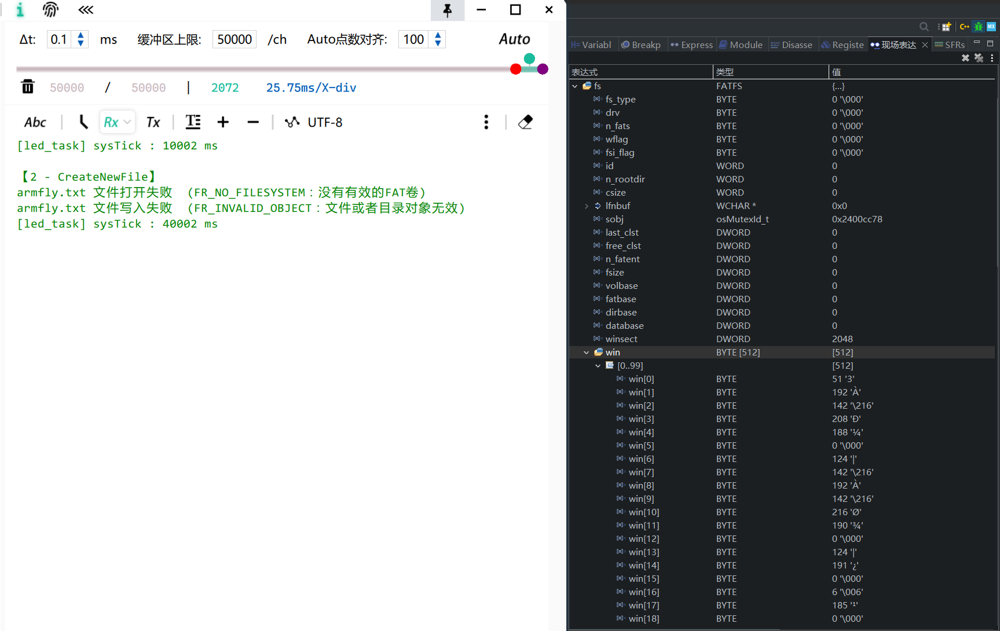
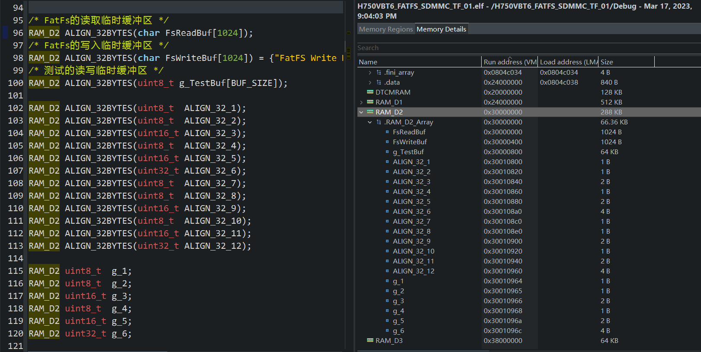
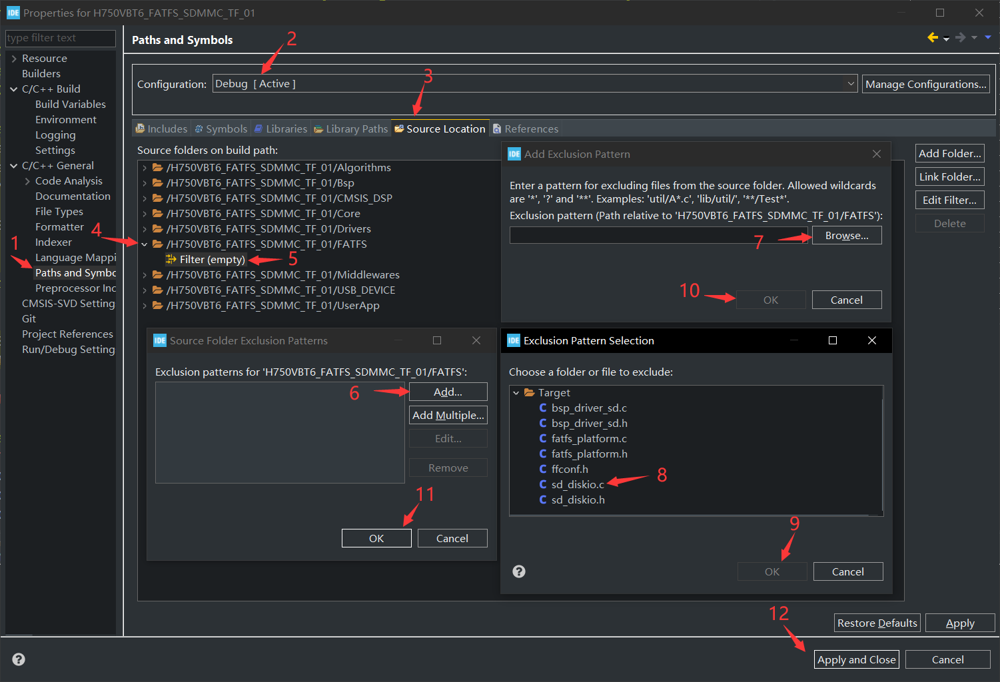
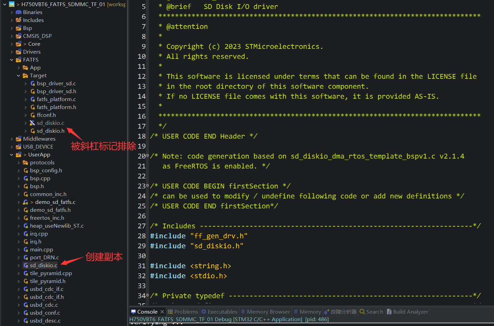

## H750VBT6_FATFS_SDMMC_TF_01

## 关于 

在 H750VBT6_chapter_88 基础上修改，使能cache，评测fatfs+sdio方案做 DS-PPK 采样数据的 实时储存的可行性

## Cache

### 配置の深坑

按照 sd_diskio.c 中介绍的方法，将ENABLE_SD_DMA_CACHE_MAINTENANCE 和 ENABLE_SCRATCH_BUFFER 使能就行：

```c
#define ENABLE_SD_DMA_CACHE_MAINTENANCE  1
#define ENABLE_SCRATCH_BUFFER
```

但调试时却看到 FATFS 全局变量内很多数据都是乱码，关闭这两个选项并关闭Cache（注释掉 main 函数中的 SCB_EnableDCache();）后测试SD卡才正常，甚是纳闷，2号命令测试如下表

| 关D-cache，2号测试命令，测试OK，FATFS fs变量的成员win[512] 内都是文件名的字符 | 开D-cache，2号测试命令，报错，FATFS fs变量的成员win[512] 内都是乱码 |
| ------------------------------------------------------------ | ------------------------------------------------------------ |
|                      |  |

将`SD_read()`中的0x3改为0x1f


再次配置为开Cache，总算乱码消失+测试SD卡正常：


这么改的原因来自这篇文章：[STM32+SDIO+FreeRTOS+FATFS在带有DMA和CACHE的平台的调试注意要点](https://blog.csdn.net/Fairchild_1947/article/details/122271451) 的分析，简述就是 FATFS 类型的 fs 变量成员 win[512] 编译后在SRAM的地址不是32字节对齐的，SD_read()中对D-Cache使用（CMSIS数据高速缓存维护API）需要被操作的地址是32字节对齐，但该函数内语句`if (!((uint32_t)buff & 0x3))`{...} 中的`!((uint32_t)buff & 0x3)`为 1时，只能说明32bit 地址值 buff **至少4字节对齐**，将0x3修改为 0x1f后，才可判断地址值 buff **至少32字节对齐**

```c
DRESULT SD_read(BYTE lun, BYTE *buff, DWORD sector, UINT count)
{
	...
#if (ENABLE_SD_DMA_CACHE_MAINTENANCE == 1)
	uint32_t alignedAddr;
#endif
	...
#if defined(ENABLE_SCRATCH_BUFFER)
	/* buff是32字节对齐 */
	if (!((uint32_t)buff & 0x1f))
		//                     ^~~~   从0x3修改为0x1f
	{
#endif
		/* Fast path cause destination buffer is correctly aligned */
		ret = BSP_SD_ReadBlocks_DMA((uint32_t*)buff, (uint32_t)(sector), count);

		if (ret == MSD_OK) {
			...
			if (BSP_SD_GetCardState() == SD_TRANSFER_OK)
			{
				res = RES_OK;
#if (ENABLE_SD_DMA_CACHE_MAINTENANCE == 1)
				/*
			the SCB_InvalidateDCache_by_Addr() requires a 32-Byte aligned address,
			adjust the address and the D-Cache size to invalidate accordingly.
				 */
				alignedAddr = (uint32_t)buff & ~0x1F;
				SCB_InvalidateDCache_by_Addr((uint32_t*)alignedAddr, count*BLOCKSIZE + ((uint32_t)buff - alignedAddr));
#endif
				break;
			}
			...
		}

#if defined(ENABLE_SCRATCH_BUFFER)
	}

	/* buff不是32字节对齐 */
	else
	{
		/* Slow path, fetch each sector a part and memcpy to destination buffer */
		int i;

		for (i = 0; i < count; i++)
		{
			ret = BSP_SD_ReadBlocks_DMA((uint32_t*)scratch, (uint32_t)sector++, 1);
			if (ret == MSD_OK )
			{
				...
#if (ENABLE_SD_DMA_CACHE_MAINTENANCE == 1)
				/*
				 *
				 * invalidate the scratch buffer before the next read to get the actual data instead of the cached one
				 */
				SCB_InvalidateDCache_by_Addr((uint32_t*)scratch, BLOCKSIZE);
#endif
				memcpy(buff, scratch, BLOCKSIZE);
				buff += BLOCKSIZE;
			}
			...
		}

		if ((i == count) && (ret == MSD_OK ))
			res = RES_OK;
	}
#endif
	return res;
}
```

> ## 为啥 0x1f  可以判断地址是否4字节对齐?
>
> - 0x1f 二进制： 00011111
>
> 例如将几个不足32字节的变量编译为对齐/不对齐32字节地址
>
> 其地址依次为：0x30010800、0x30010820、0x30010840...
> 减去0x30010800，简化为 0x00、0x20、0x40、0x60、0x80、0xa0、0xc0、0xe0
> （最大只能到0xe0，0xe0 + 0x20 等于 0x100，尾数回到 0x00 )
>
> 列出下表格：""Δ" 表示 "以16进制数表示的32字节对齐地址的最后2位的"
>
> | Δ16进制值 | Δ10进制值 | Δ2进制值      | Δ & 0x1f     | !( Δ & 0x1f ) |
> | --------- | --------- | ------------- | ------------ | ------------- |
> | 0x00      | 0         | 00000000      | 00000000     | true          |
> | 0x20      | 32        | 00100000      | 00000000     | true          |
> | 0x40      | 64        | 01000000      | 00000000     | true          |
> | 0x60      | 96        | 01100000      | 00000000     | true          |
> | 0x80      | 128       | 10000000      | 00000000     | true          |
> | 0xa0      | 160       | 10100000      | 00000000     | true          |
> | 0xc0      | 192       | 11000000      | 00000000     | true          |
> | 0xe0      | 224       | 11100000      | 00000000     | true          |
> | ~~0x100~~ | ~~256~~   | ~~100000000~~ | ~~00000000~~ | ~~true~~      |
>
> 秒懂：
>
> 对于 & 0xf 判断 4字节对齐，规律依据是 32字节对齐地址的最后 的 5 个bit 必定是 0
> 对于 & 0x3 判断 4字节对齐，规律依据是 4字节对齐地址的最后 的 2 个bit 必定是 0

所以，& 0x3 会发生对4字节对齐地址执行需要参数是32字节对齐的SCB_InvalidateDCache_by_Addr()，那么根源性问题就是SCB_InvalidateDCache_by_Addr() 参数是 FATFS结构体变量fs的成员win[512]的4字节对齐地址，导致错位产生乱码：


注意，只能将SD_read()中的0x3改为0x1f，不要将 SD_write()中的0x3改为0x1f 

> 按道理应该要修改的，但是0x3才正常真是奇了怪了：
>
> 测试：将SD_read()也修改为0x1f
>
> >  f_open() 会返回 FR_NO_FILESYSTEM：没有有效的FAT卷
> > f_write() 会返回 FR_INVALID_OBJECT：文件或者目录对象无效

由于需要修改的 sd_diskio.c 的0x3位置是cubemx自动生成会覆盖的地方，为了以后修改cubemx配置重新生成的代码不与修改冲突，可以将 修改后的 sd_diskio.c复制一份到工程内用户创建的文件夹，然后在CubeIDE 的过滤器中屏蔽掉 CubeMX 自动生成的 sd_diskio.c，步骤如下：





### 读写速度下降

以下是使用三星64G EVO测试 6号和7号命令的结果

| IO SIZE | 写速度   | 写耗时  | 读速度   | 读耗时 | 测试文件名称 | 测试文件大小 | 校验文件数据 |
| ------- | -------- | ------- | -------- | ------ | ------------ | ------------ | ------------ |
| 512B    | 453KB/S  | 18064ms | 971KB/S  | 8433ms | Speed00.txt  | 8192KB       | N/A          |
| 1KB     | 869KB/S  | 9422ms  | 1650KB/S | 4962ms | Speed01.txt  | 8192KB       | N/A          |
| 2KB     | 1654KB/S | 4952ms  | 2449KB/S | 3345ms | Speed02.txt  | 8192KB       | N/A          |
| 4KB     | 2827KB/S | 2897ms  | 3340KB/S | 2452ms | Speed03.txt  | 8192KB       | N/A          |
| 8KB     | 3496KB/S | 2343ms  | 4444KB/S | 1843ms | Speed04.txt  | 8192KB       | N/A          |
| 16KB    | 4740KB/S | 1728ms  | 4949KB/S | 1655ms | Speed05.txt  | 8192KB       | N/A          |
| 32KB    | 4824KB/S | 1698ms  | 5375KB/S | 1524ms | Speed06.txt  | 8192KB       | N/A          |
| 64KB    | 4818KB/S | 1700ms  | 5371KB/S | 1525ms | Speed07.txt  | 8192KB       | N/A          |

| IO SIZE | 写速度   | 写耗时  | 读速度   | 读耗时 | 测试文件名称 | 测试文件大小 | 校验文件数据 |
| ------- | -------- | ------- | -------- | ------ | ------------ | ------------ | ------------ |
| 512B    | 455KB/S  | 18000ms | 1067KB/S | 7677ms | Speed00.txt  | 8192KB       | OK           |
| 1KB     | 894KB/S  | 9163ms  | 1120KB/S | 7310ms | Speed01.txt  | 8192KB       | OK           |
| 2KB     | 1762KB/S | 4648ms  | 1821KB/S | 4498ms | Speed02.txt  | 8192KB       | OK           |
| 4KB     | 3211KB/S | 2551ms  | 2724KB/S | 3007ms | Speed03.txt  | 8192KB       | OK           |
| 8KB     | 3944KB/S | 2077ms  | 3574KB/S | 2292ms | Speed04.txt  | 8192KB       | OK           |
| 16KB    | 4740KB/S | 1728ms  | 4164KB/S | 1967ms | Speed05.txt  | 8192KB       | OK           |
| 32KB    | 4835KB/S | 1694ms  | 4350KB/S | 1883ms | Speed06.txt  | 8192KB       | OK           |
| 64KB    | 4827KB/S | 1697ms  | 4376KB/S | 1872ms | Speed07.txt  | 8192KB       | OK           |

## 模拟实时读写发生器

> 待补充