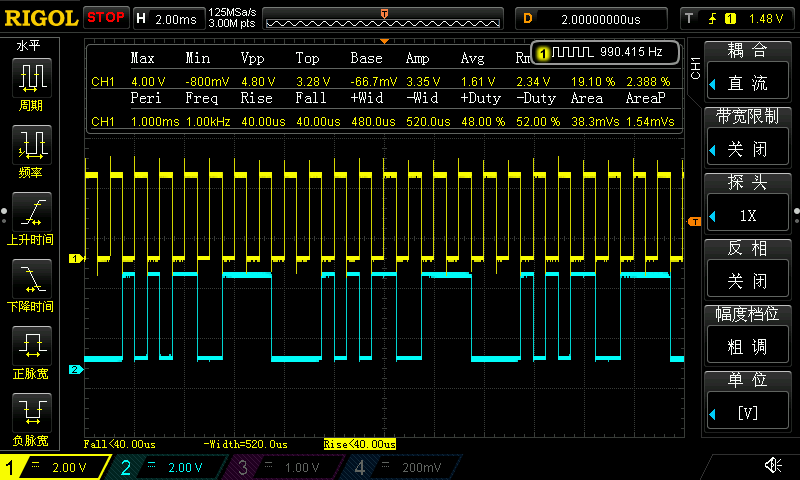
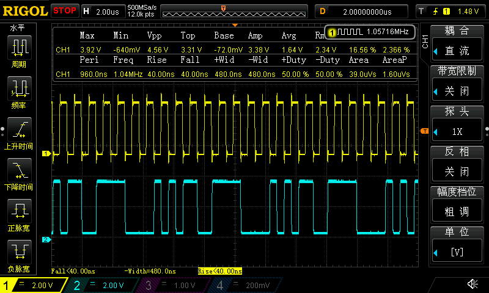
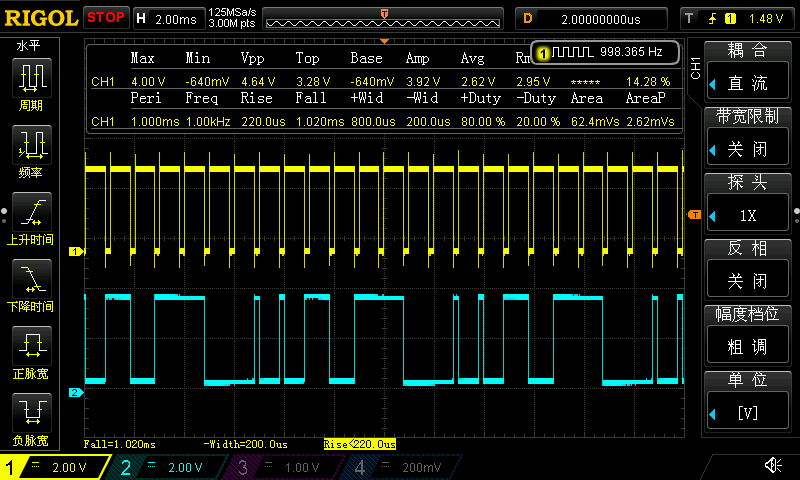
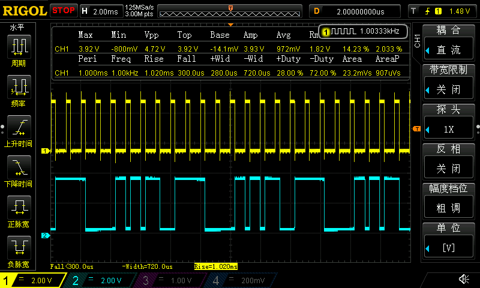
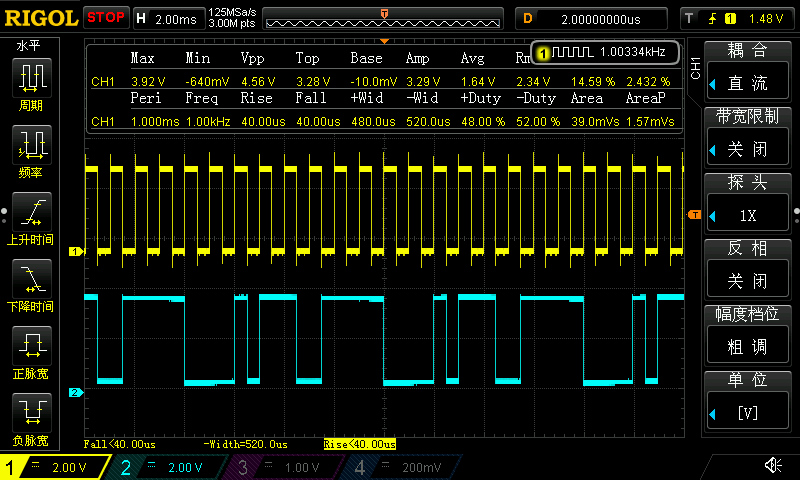
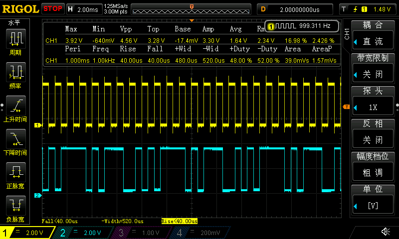
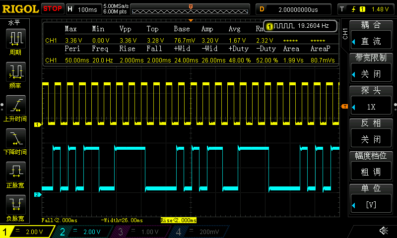

## 第41章 STM32H7的BDMA应用之控制任意IO 做 PWM和脉冲数控制

## 实际测试

### 串口信息

```
*************************************************************
CPU : STM32H750VBT6, LQFP100, 主频: 400MHz
UID = 32363235 31305114 001F002C
*************************************************************
BDMA应用之控制任意IO做PWM和脉冲数控制:
BDMA请求生成信号 为LPTIM2 ，LPTIM2时钟源频率：100MHz，默认PWM频率1KHz，占空比50%
BDMA + LPTIM2 控制的IO为PE0，需要使用示波器测量LPTIM本身输出的PWM引脚为PB13（虽然没有必要让LPTIM2 生成的PWM输出到io，但还是启用以方便测试）操作提示:
1. KEY A 长按或连续长按，以2倍增量修改LPTIM2 pwm频率，短按以应用PWM修改，并打开PWM
2. KEY B 长按或连续长按以10%增量修改LPTIM2 pwm占空比，短按关闭PWM
3. 串口输入A，设置波形数据前8位
4. 串口输入B，设置波形数据后8位
```

### 默认IO_Toggle + 50%占空比

默认IO_Toggle使用的电平数据：`1010,1100,1111,0000`

```c
/* 任意GPIO PWM脉冲数据 */
#define bitLVL_NUM 2
uint8_t bitLVL[bitLVL_NUM] = {
		B10101100,	//以bit指定一串电平
		B11110000
};
```

设置1000Hz

```
KEY A 短按，打开 LPTIM2 PWM
期望pwm占空比： 50.000000%
期望pwm频率： 1000Hz
实际pwm占空比： 50.000000%
实际pwm占空比步幅： 0.002000%
实际pwm频率： 1000.000000Hz
```

设置1048576Hz

```
......
KEY A 长按 修改期望pwm频率： 524288Hz
KEY A 长按 修改期望pwm频率： 1048576Hz
KEY A 短按，打开 LPTIM2 PWM
期望pwm占空比： 50.000000%
期望pwm频率： 1048576Hz
实际pwm占空比： 49.473682%
实际pwm占空比步幅： 1.052631%
实际pwm频率： 1052631.625000Hz
```

| 1000Hz                                                       | 1048576Hz                                                    |
| ------------------------------------------------------------ | ------------------------------------------------------------ |
|  |  |

### 默认IO_Toggle + 修改占空比

80%

```
......
KEY A 长按 修改期望pwm占空比： 60.000000%
KEY A 长按 修改期望pwm占空比： 70.000000%
KEY A 长按 修改期望pwm占空比： 80.000000%

KEY A 短按，打开 LPTIM2 PWM
期望pwm占空比： 80.000000%
期望pwm频率： 1000Hz
实际pwm占空比： 80.000000%
实际pwm占空比步幅： 0.002000%
实际pwm频率： 1000.000000Hz
```

30%

```
......
KEY A 长按 修改期望pwm占空比： 10.000000%
KEY A 长按 修改期望pwm占空比： 20.000000%
KEY A 长按 修改期望pwm占空比： 30.000000%
KEY A 短按，打开 LPTIM2 PWM
期望pwm占空比： 30.000000%
期望pwm频率： 1000Hz
实际pwm占空比： 30.000000%
实际pwm占空比步幅： 0.002000%
实际pwm频率： 1000.000000Hz
```

| 80%占空比                                                    | 30%占空比                                                    |
| ------------------------------------------------------------ | ------------------------------------------------------------ |
|  |  |

### 串口修改波形

首先，修改默认波形数据前8位 为`10111001`

```
A
设置波形数据前8位，请输入形如 01001110 的数据

101110010
接收到的数据：1 0 1 1 1 0 0 1 输入数据有效，已更改PWM波形数据
```

然后，修改默认波形数据后8位 为`01011110`

```
B
设置波形数据后8位，请输入形如 01001110 的数据

01011110
接收到的数据：0 1 0 1 1 1 1 0 输入数据有效，已更改PWM波形数据
```

| 首先，修改波形数据前8位 为10111001                           | 然后，修改默认波形数据后8位 为01011110                       |
| ------------------------------------------------------------ | ------------------------------------------------------------ |
|  |  |

### BDMA写入BSSR寄存器是否会干扰同一GPIO组的其他引脚？

默认LPTIM2+BDMA作用的GPIO是PE0，与开发板现有的GPIO组引脚不存在交集

现在将作用的引脚改为GPIOC组的PC1，同时TIM6的中断控制了PC3的LRGB_G指示灯以20Hz闪烁指示系统运行，那么BDMA写入BSSR寄存器对PC1的电平修改会干扰PC3的电平嘛，答案是不会的：

> 虽然BDMA会将 32bit TO_Toggle 数组元素数据整个写入GPIOC组的BSSR以控制PC1的电平，但是BSSR寄存器很特殊，只能写1，清0无效，这样写入BSSR只作用于 TO_Toggle 数组元素指定的一个引脚，对GPIOC组的其他GPIO_PIN无影响

废话那么多，实际测试一下看看：

任意PWM数据为默认的IO_Toggle，修改LPTIM2的PWM频率为16Hz

```
......
KEY A 长按 修改期望pwm频率： 4Hz
KEY A 长按 修改期望pwm频率： 8Hz
KEY A 长按 修改期望pwm频率： 16Hz
KEY A 短按，打开 LPTIM2 PWM
期望pwm占空比： 50.000000%
期望pwm频率： 16Hz
实际pwm占空比： 49.997952%
实际pwm占空比步幅： 0.002048%
实际pwm频率： 16.000040Hz
```

示波器CH1测量PC3引脚（控制LRGB_G），CH2测量PC1引脚（控制LRGB_B），可以看到两组信号互不干扰（各自电平、频率独立）

|                                  |                                                  |
| -------------------------------- | ------------------------------------------------ |
|  |  |

