## H750VBT6_chapter_88

## 关于

在某个H750VBT6_ST_USB_CDC工程（带有fibre通信框架并处理好print线程安全）的基础上，添加安富莱V7教程 《第88章 STM32H7 的 SDMMC总线应用之 SD 卡移植 FatFs 文件系统》 的相关例程： **V7-025_FatFS文件系统例子（SD卡 V1.2）**  代码 中的示例程序 `demo_sd_fatfs.c`文件到 `H750VBT6_chapter_88\UserApp` 路径下，少许修改后进行测试

FATFS版本：R0.12c

本工程使用三星64G evo 红卡 和闪迪64G ultra测试，使用DiskGenius格式化两款sd卡为FAT32 + 簇大小32KB（默认值），簇大小多大的问题

## 参考资料

ChaN老师

- [FatFs - Generic FAT Filesystem Module](http://elm-chan.org/fsw/ff/00index_e.html)（此页面相当于FatFs官方文档）

  > FatFs has being developped as a personal project of the author, ChaN （FatFs 是作为作者 ChaN 的个人项目开发的）
  > 此页面 Resources 部分有 *Getting Started: [FatFs Application Note](http://elm-chan.org/fsw/ff/doc/appnote.html)*
  
- [FatFs 用户论坛](http://elm-chan.org/fsw/ff/bd/)

ST官方

- [AN5200：STM32H7系列SDMMC主机控制器入门](https://www.st.com/resource/zh/application_note/an5200-getting-started-with-stm32h7-series-sdmmc-host-controller-stmicroelectronics.pdf)
- [UM1721 Rev2：在 STM32Cube 上开发 FatFs 相关应用](https://www.st.com/resource/zh/user_manual/um1721-developing-applications-on-stm32cube-with-fatfs-stmicroelectronics.pdf)
- [UM1721 Rev3：Developing applications on STM32Cube™ with FatFs](https://www.st.com/resource/en/user_manual/um1721-developing-applications-on-stm32cube-with-fatfs-stmicroelectronics.pdf)
- [YouTube：STM32H7 OLT - 48. Peripheral SDMMC interface](https://www.youtube.com/watch?v=nGH7pV6gww0)
- [YouTube：STM32 – Creating a File System on a SD card](https://www.youtube.com/watch?v=I9KDN1o6924)

NXP

- [Freescale MSD FATFS API Reference Manual](https://www.nxp.com/docs/en/reference-manual/MSDFATFSAPIRM.pdf)

armfly 论坛

- [ChaN老师建议大家格式化SD卡不要用电脑自带的工具，请使用专用软件否则数据对齐被破坏](https://www.armbbs.cn/forum.php?mod=viewthread&tid=19155)

  > [推荐使用SD卡联盟的 SD Card Formatter工具格式化](https://www.sdcard.org/downloads/formatter/)

- [格式化SD时，簇大小的分配，簇越大速度越快，但较浪费](https://www.armbbs.cn/forum.php?mod=viewthread&tid=13819&highlight=%B8%F1%CA%BD%BB%AFSD%CA%B1%A3%AC%B4%D8%B4%F3%D0%A1%B5%C4%B7%D6)

  > 硬汉哥测试：将4G的卡，簇大小选择为32KB进行格式化，实际用STM32F103+FlashFS速度居然飙到3.6MB/S---5.1MB/S，测试时这两个速度交替出现，FlashFS的缓冲开到32KB
  >
  > 问题：FatFs缓冲开到等于簇大小有什么优势？
  >
  > > 根据本文 **三星 64G EVO (读不进行校验)** 的小节，缓冲区等于SD卡簇大小32KB时，吞吐量相比16KB有显著提升，将缓冲区提升到 64KB 时提升没有 16KB 提升到 32KB 的提升明显，FatFs最大multi block 传输只支持128个 block，即 64KB缓冲区。我认为考虑到缓冲区与读写速度之比，对于簇大小32KB的SD卡应优先选择 32KB，若项目代码开发完后还有多余的 SRAM 空间，可以增大到最大的 64KB缓冲区

- [求一个STM32H7 SDMMC1+FATFS + FreeRTOS 的工程 基于cubemx导出的](https://www.armbbs.cn/forum.php?mod=viewthread&tid=98643)

- [SDMMC+FatFs+DMA问题](https://www.armbbs.cn/forum.php?mod=viewthread&tid=94962&highlight=SDMMC%2BFatFs%2BDMA)

- [STM32H7的SDIO自带的DMA控制器数据传输的地址是强制4字节对齐，这就非常不方便了](https://www.armbbs.cn/forum.php?mod=viewthread&tid=94066&fromuid=58)

- [ST这骚操作，解决H7的SDIO DMA的4字节对齐问题，搞了个复制粘贴](https://www.armbbs.cn/forum.php?mod=viewthread&tid=100130)

  > 指 `sd_diskio_dma_template.c` 文件，注意是 2019 年 MCD 团队的代码，当前是 2023年，CubeMX自动生成的sd_disk.c文件的DMA读写依然使用了memcpy 512字节复制粘贴骚操作
  >
  > 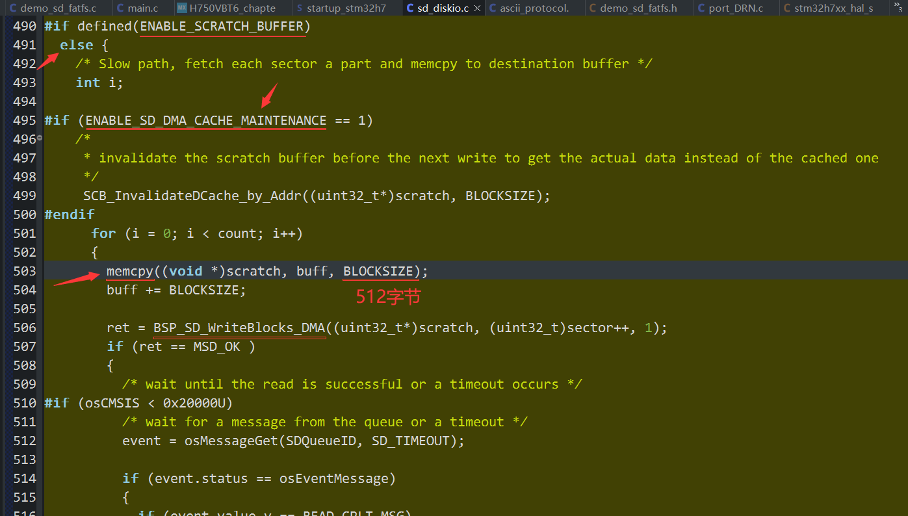
  >
  > 默认配置没有ENABLE_SCRATCH_BUFFER (没有使能临时缓冲区)，而是直接使用 BSP_SD_WriteBlocks_DMA() ，这就要求 4字节对齐

- [H7的8线SDIO DMA驱动eMMC的裸机性能，读43MB/S，写18.8MB/S](https://www.armbbs.cn/forum.php?mod=viewthread&tid=95953)

  > 8线SDIO，DMA方式，50MHz时钟频率SDR，读出操作每次200个block，写操作每次100个block，读写都是测试100次，求平均

博客、帖子

- [Leung_ManWah：STM32CubeMX学习笔记（27）——FatFs文件系统使用（操作SD卡）](https://blog.csdn.net/qq_36347513/article/details/121776975)

  > 注意H7的SDMMC外设内嵌 IDMA，无需配置通用DMA
  
- hhdjz13813

  > [读取TF卡S.M.A.R.T.信息第二季 12款工业级TF卡评测](https://www.mydigit.cn/thread-349896-1-1.html)
  >
  > [分享一下收集的十多款TF卡的跑分数据以及读取TF卡S.M.A.R.T.信息的方法](https://www.mydigit.cn/thread-335366-1-1.html)

- farseerfc

  > [上篇：柱面-磁头-扇区寻址的一些旧事](https://farseerfc.me/zhs/history-of-chs-addressing.html)
  >
  > [下篇：SSD 就是大U盘？聊聊闪存类存储的转换层](https://farseerfc.me/zhs/flash-storage-ftl-layer.html)

- [xsx FAT分析系列12篇文章](https://www.zhihu.com/people/xsx-78-93/posts)

  > [FAT文件在磁盘的存储结构](https://zhuanlan.zhihu.com/p/603722395)
  
- 一位不愿意透漏姓氏的底层搬砖人员

  > [FAT32 文件系统在磁盘上的结构](https://blog.csdn.net/weixin_38878510/article/details/109345127)
  >
  > [FAT 文件系统代码分析--文件系统挂载篇](https://blog.csdn.net/weixin_38878510/article/details/109830103)

## CubeMX的配置要点

仅列举出需要注意的部分

### 时钟

SDMMC1,2 共用 两个可选择的时钟源，不能超过200MHz


我使用 三星64G EVO Class10 的SD卡，时钟应该配置为多少呢？根据后续的测试，此卡支持 SDR50, DDR50, SDR104 的速度，但AN5200的下表列出这三种速度需要1.8V的信号电压转换器，而我的开发板是3.3V GPIO直接连 SD卡的，所以只能用 HS 或者 DS 模式，那么取更高的 HS，SDMMC的时钟频率 配置为 50MHz

```
[21:20:11.003] UHS-I SD Card <50MB/S for SDR50, DDR50 Cards, MAX Clock < 50MHz OR 100MHz
[21:20:11.003] UHS-I SD Card <104MB/S for SDR104, MAX Clock < 108MHz, Spec version 3.01
```

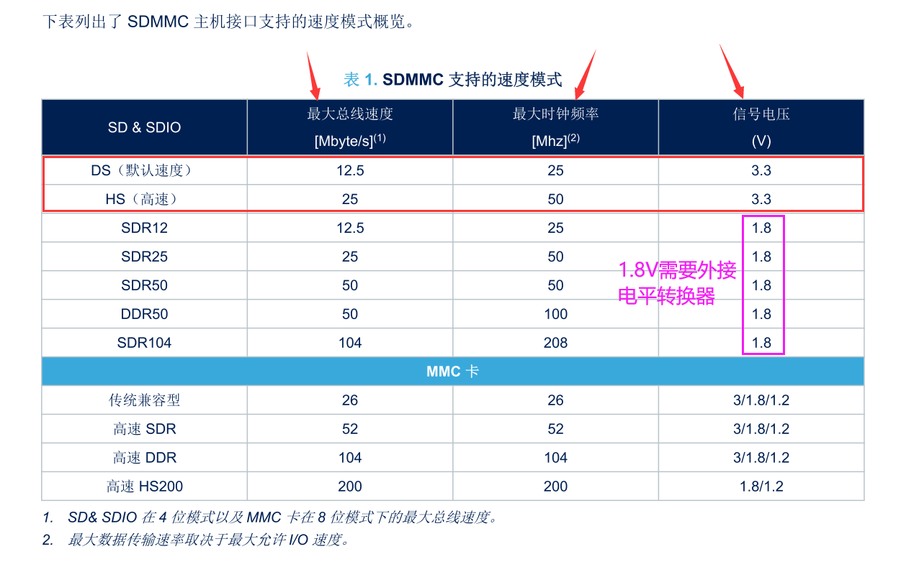

当前的时钟树 的 SDMMC 的时钟源我配置为200MHz，可以在参数项内设置 4倍 时钟分频得到 50MHZ，当然也可以进行其他分频组合


### NVIC

使能全局中断即可，由于使能了FreeRTOS，且ST固件库实现的相关中断函数内调用了RTOS的API，因此默认优先级为 5，务必保持


实测：将此优先级设为0后，程序在 `port_DRN.c` 的`vPortValidateInterruptPriority()` 的 `configASSERT( ucCurrentPriority >= ucMaxSysCallPriority );`的 for(;;)死循环，因此确信当前 ST 固件库处理了 FatFs + CMSIS OS 多任务的问题

### FatFS

CODE_PAGE默认是Latin，可修改为简体中文，可以使能长文件名支持

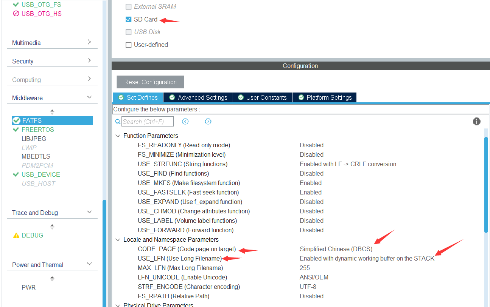

默认不支持exFAT，会无法识别到有效的分区，可以在 CubeMX 中 FATFS使能FS_EXFAT以支持 64G及以上 SD卡格式化的 exFAT：

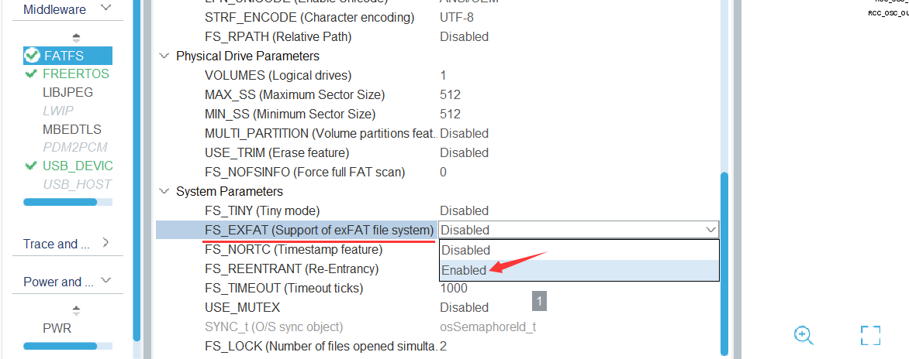

### FreeRTOS

启用互斥锁（可选，如果存在多个优先级不同的任务使用FatFs就需要，本工程只有一个任务访问SD卡就不需要）

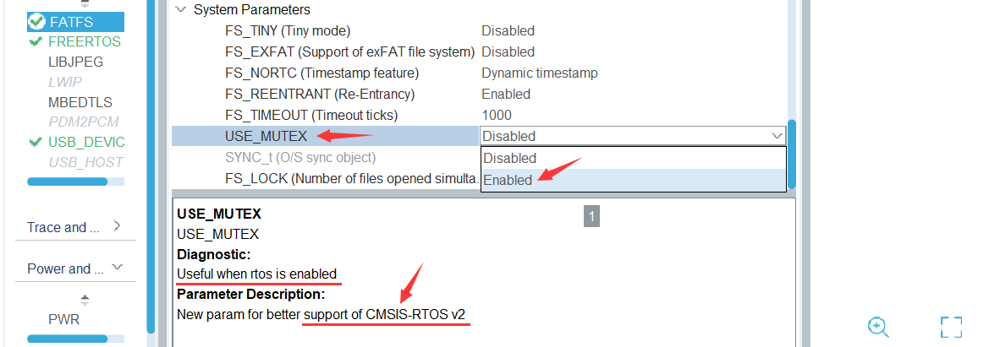

对整个工程搜索USE_MUTEX，仅在 `Middlewares\Third_Party\FatFs\src\option\syscall.c`内相关函数中用其预处理 CMSIS OS 互斥锁API：并且根据上图CubeMX，支持 CMSIS-RTOS V2的

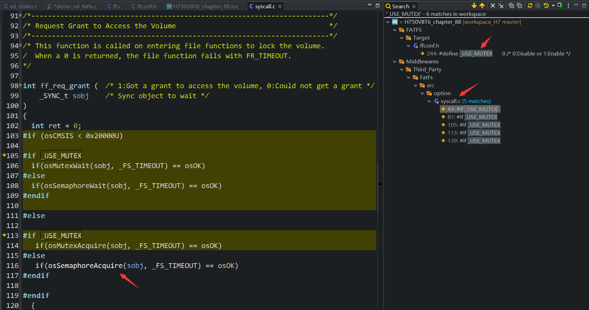

可以看出默认使用二值信号量，开启USE_MUTEX后改用互斥锁，互斥锁相比信号量的区别在 安富莱V5 FreeRTOS教程的 23.1.2 优先级翻转问题中有讲解

关于这个文件内函数的作用，在[UM1721](https://www.st.com/resource/zh/user_manual/um1721-developing-applications-on-stm32cube-with-fatfs-stmicroelectronics.pdf)的可重入性小节中有介绍：


裸机环境下，ST的 [STM32 – Creating a File System on a SD card](https://www.youtube.com/watch?v=I9KDN1o6924) 教程里，加大系统堆栈为 0x400 和 0x800

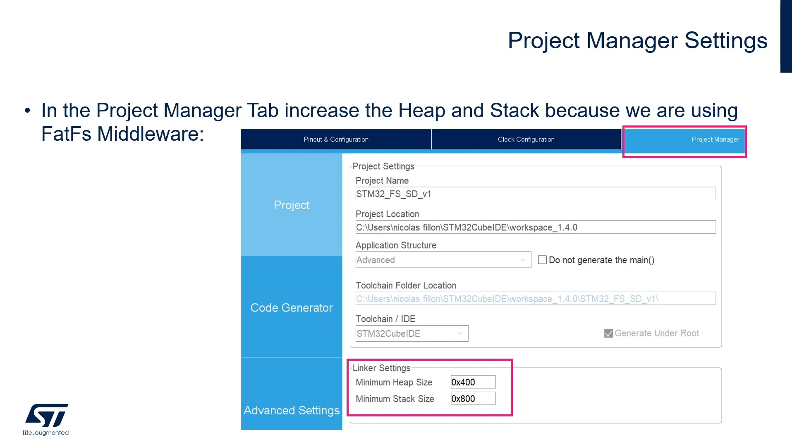

但我目前的工程FatFs相关的是在FreeRTOS的任务里跑的，因此不需要加大系统栈，而是加大任务栈 TOTAL_HEAP_SIZE，随便给个32KB好了：


### MPU

本工程代码默认使用 AXI SRAM 512KB 的内存区，修改前 MPU 对 AXI SRAM 的配置如下：

```
MPU_InitStruct.IsShareable = MPU_ACCESS_NOT_SHAREABLE;
MPU_InitStruct.IsCacheable = MPU_ACCESS_CACHEABLE;
MPU_InitStruct.IsBufferable = MPU_ACCESS_BUFFERABLE;
```

这种使能Cache的情况下正常使用 FatFS 比较复杂，以后单独开一个工程测试

本工程使用 sd_dsikio.c 的默认配置不支持 cache，那么务必在 MPU 配置内禁用此区的  SHARE、BUFFER、CACHE

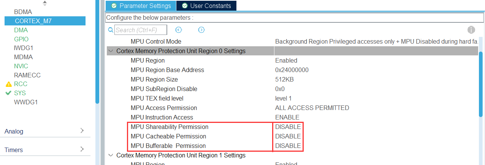

确保自动生成的 main.c 中 MPU的对于此区的配置如下：

```c
MPU_InitStruct.IsShareable = MPU_ACCESS_NOT_SHAREABLE;
MPU_InitStruct.IsCacheable = MPU_ACCESS_NOT_CACHEABLE;
MPU_InitStruct.IsBufferable = MPU_ACCESS_NOT_BUFFERABLE;
```

否则，测试时 f_mount() 正常不报错，但  f_opendir()等函数全报错： `FR_NO_FILESYSTEM：没有有效的FAT卷`

```bash
[21:20:11.003] 【1 - ViewRootDir】
[21:20:11.003] UHS-I SD Card <50MB/S for SDR50, DDR50 Cards, MAX Clock < 50MHz OR 100MHz
[21:20:11.003] UHS-I SD Card <104MB/S for SDR104, MAX Clock < 108MHz, Spec version 3.01
[21:20:11.003] 打开根目录失败  (FR_NO_FILESYSTEM：没有有效的FAT卷)
```

### 开启FreeRTOS下自动生成的 sd_dsikio.c 的默认配置

 sd_dsikio.c 有以下可选配置被注释掉，本工程不取消默认禁用的任何一个配置项，使用默认的配置

基于 sd_diskio_dma_rtos_template_bspv1.c v2.1.4 生成，支持 FreeRTOS

```c
/* Note: code generation based on sd_diskio_dma_rtos_template_bspv1.c v2.1.4
   as FreeRTOS is enabled. */
```

禁用向用户任务发送读写状态消息

```c
/*
...
#define RW_ERROR_MSG       (uint32_t) 3
#define RW_ABORT_MSG       (uint32_t) 4
*/
```

禁用在任务里初始化SD卡，默认在main函数内初始化

```c
/* #define DISABLE_SD_INIT */
```

禁用 IDMA CACHE ，所以用户不能使能程序默认RAM的cache

```c
/* #define ENABLE_SD_DMA_CACHE_MAINTENANCE  1 */
```

禁用 4 字节对齐的暂存缓冲区，所以用户传输数据时的内存地址务必要4字节对齐

```c
/* #define ENABLE_SCRATCH_BUFFER */
```

**CubeMX自动生成的 STM32H7 + FatFs，IDMA是单缓冲还是双缓冲？**

跟踪 sd_dsikio.c 的写函数调用`HAL_SD_WriteBlocks_DMA()`内让人感兴趣的代码如下

```c
HAL_StatusTypeDef HAL_SD_WriteBlocks_DMA(SD_HandleTypeDef *hsd, const uint8_t *pData, uint32_t BlockAdd,
                                         uint32_t NumberOfBlocks)
{
...
    (void)SDMMC_ConfigData(hsd->Instance, &config);
    __SDMMC_CMDTRANS_ENABLE(hsd->Instance);
    
    /* Write Blocks in Polling mode */
    if (NumberOfBlocks > 1U)
    {
      hsd->Context = (SD_CONTEXT_WRITE_MULTIPLE_BLOCK | SD_CONTEXT_DMA); // 批量block dma传输

      /* Write Multi Block command */
      errorstate = SDMMC_CmdWriteMultiBlock(hsd->Instance, add);
    }
    else
    {
      hsd->Context = (SD_CONTEXT_WRITE_SINGLE_BLOCK | SD_CONTEXT_DMA); // 单个block dma传输

      /* Write Single Block command */
      errorstate = SDMMC_CmdWriteSingleBlock(hsd->Instance, add);
    }
    ...
}
```

HAL_SD_WriteBlocks_DMA() 的代码代码符合 AN5200：图25 或 图 25的红框内部分，但IDMA究竟是单缓冲还是双缓冲？

| 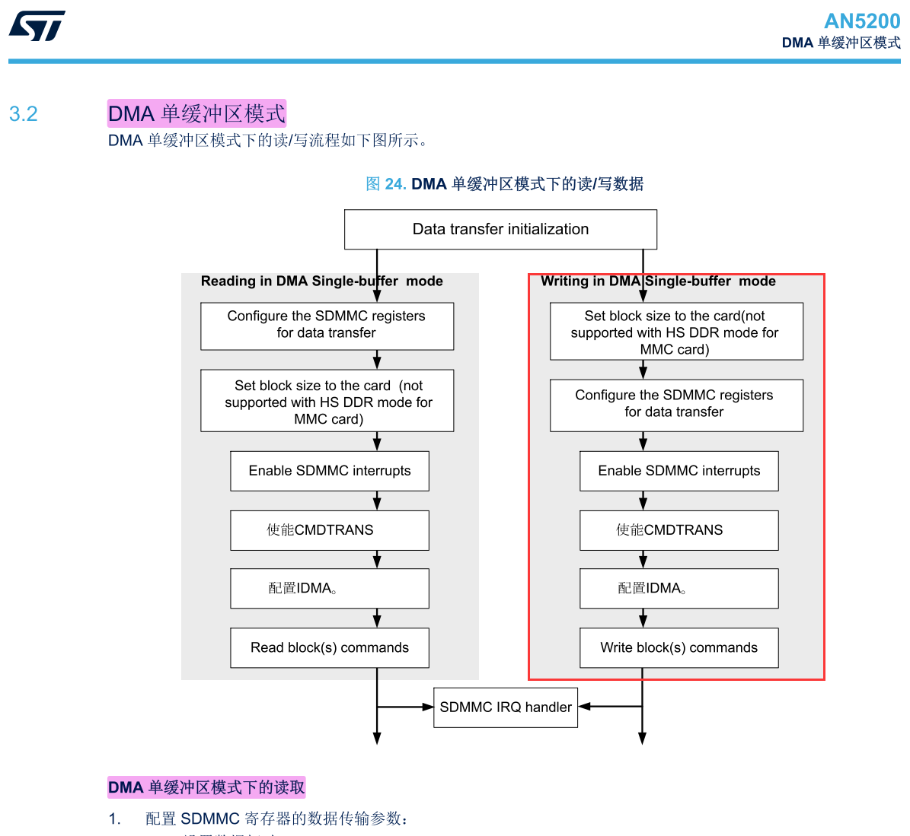 |  |
| -------------------------------------------------------- | -------------------------------------------------------- |

在 stm32h7xx_hal_sd.c 的 HAL_SD_IRQHandler() 中有以下感兴趣的代码：

```c
void HAL_SD_IRQHandler(SD_HandleTypeDef *hsd) 
{
...
  else if (__HAL_SD_GET_FLAG(hsd, SDMMC_FLAG_IDMABTC) != RESET)
  {
    __HAL_SD_CLEAR_FLAG(hsd, SDMMC_FLAG_IDMABTC);
    if (READ_BIT(hsd->Instance->IDMACTRL, SDMMC_IDMA_IDMABACT) == 0U)
    {
      /* Current buffer is buffer0, Transfer complete for buffer1 */
      if ((context & SD_CONTEXT_WRITE_MULTIPLE_BLOCK) != 0U)
      {
#if defined (USE_HAL_SD_REGISTER_CALLBACKS) && (USE_HAL_SD_REGISTER_CALLBACKS == 1U)
        hsd->Write_DMADblBuf1CpltCallback(hsd);
#else
        HAL_SDEx_Write_DMADoubleBuf1CpltCallback(hsd);
#endif /* USE_HAL_SD_REGISTER_CALLBACKS */
      }
      else /* SD_CONTEXT_READ_MULTIPLE_BLOCK */
      {
#if defined (USE_HAL_SD_REGISTER_CALLBACKS) && (USE_HAL_SD_REGISTER_CALLBACKS == 1U)
        hsd->Read_DMADblBuf1CpltCallback(hsd);
#else
        HAL_SDEx_Read_DMADoubleBuf1CpltCallback(hsd);
#endif /* USE_HAL_SD_REGISTER_CALLBACKS */
      }
    }
    else /* SD_DMA_BUFFER1 */
    {
      /* Current buffer is buffer1, Transfer complete for buffer0 */
      if ((context & SD_CONTEXT_WRITE_MULTIPLE_BLOCK) != 0U)
...
    }
  }
...
}
```

以上代码判断 buffer 0 和 buffer 1 执行 IDMA回调函数，对应AN5200 图 26. IDMA 双缓冲区模式示例

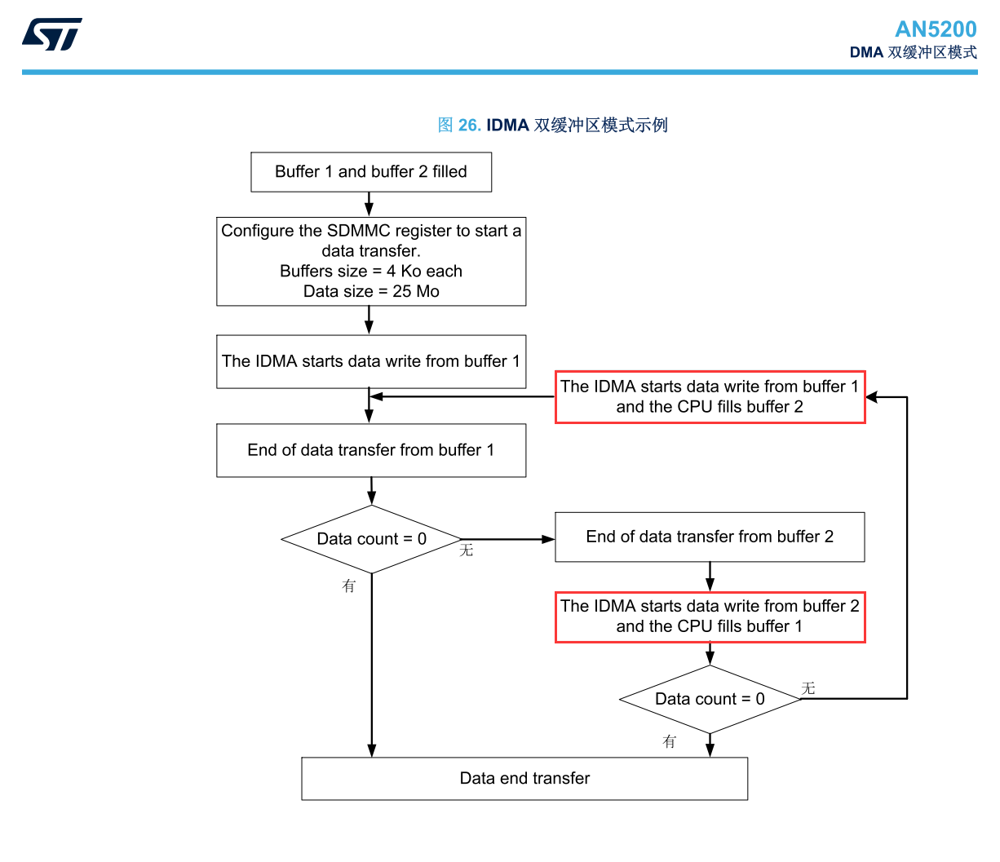

我在后文不同IO/SIZE下读写测试时，在HAL_SD_IRQHandler() 处理 IDMA双缓冲区的代码内打断点，发现不会运行到里面，只会运行到第二个 else if 里

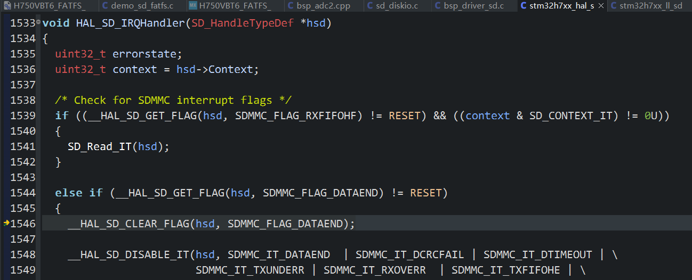

AN5200 的第4小节：如何使用文件系统 FATFS 通过SDMMC主机接口读取/写入：

> **使用文件系统 FATFS** 可在轮询、中断和DMA模式下从SD卡传输数据。以下示例（位于 STM32Cube_FW_H7_V1.2.0 中）描述了如何在 **STM32H743I-EVAL** 板上使用**SDMMC在DMA单缓冲区模式下** 创建、写入和读取文本文档。

最后，我没有在网上找到 任何 H7 + Fatfs + IDMA 双缓冲的相关示例代码，所以 Fatfs 使用的一定是 IDMA 单缓冲模式

## 对`demo_sd_fatfs.c`的修改

目的：直接对接当前CubeMX自动生成的代码（2023年 CubeMX 6.6 ）

将 `#include "sd_diskio_dma.h"` 注释掉

```
//#include "sd_diskio_dma.h"
```

> 该文件的将HAL库API封装为SD卡初始化、读写、状态查询等的API，但注意这些都不带RTOS下的处理，因为本工程跑FreeRTOS，将SD卡的示例程序丢在 USB 通信任务 调用的 OnAsciiCmd() 函数内执行，所以不使用这个文件

cmd变量改为 DemoFatFS() 的参数，并删除开头的一截代码，仅保留 switch 段

```c
void DemoFatFS(uint8_t cmd)
{
	printf("\r\n");
	switch (cmd)
	{
	    case '0':
	    	DispMenu();
...
}
```

新建 demo_sd_fatfs.h，将 void DemoFatFS(uint8_t cmd); 在此文件声明

ascii_protocol.cpp 包含 demo_sd_fatfs.h，在OnAsciiCmd() 函数最后调用 DemoFatFS()：

```c++
...
#include "demo_sd_fatfs.h"
...
void OnAsciiCmd(const char* _cmd, size_t _len, StreamSink &_responseChannel)
{
...
    DemoFatFS(_cmd[0]);
    /*---------------------------- ↑ Add Your CMDs Here ↑ -----------------------------*/
}
```

## CubeMX配置FATFS的RTOS多任务的支持问题

### 先说结论

当前我使用CubeMX v6.6 + **STM32CubeH7 V1.11.0 / 04-Nov-2022**   的包，ST 的团队已经处理好了FATFS + IDMA + CMSIS OS + 多任务互斥访问 FatFs API，完全可用CubeMX自动生成的代码

### 考古

安富莱 2018年的 **V7-025_FatFS文件系统例子（SD卡 V1.2）**中的  sd_diskio_dma_template.h 头文件位于`V7-025_FatFS文件系统例子（SD卡 V1.2）\Libraries\FatFs\src\drivers`，抬头版权声明如下，是 ST 的 MCD 团队在 2017年写的代码：

```c
  /******************************************************************************
  * @file    sd_diskio_dma_template.h
  * @author  MCD Application Team
  * @version V2.0.2
  * @date    10-November-2017
  * @brief   Header for sd_diskio_dma_template.c module.This file needs to be
             customized then copied into the application project
  ******************************************************************************/
```

但是被安富莱放到FatFs文件夹里了，注意FatFS源码并不包括该代码


2020年，硬汉哥回帖不看好CubeMX生成的FatFS多任务机制，配套的V7例子的这部分驱动文件至今还是2018年的代码


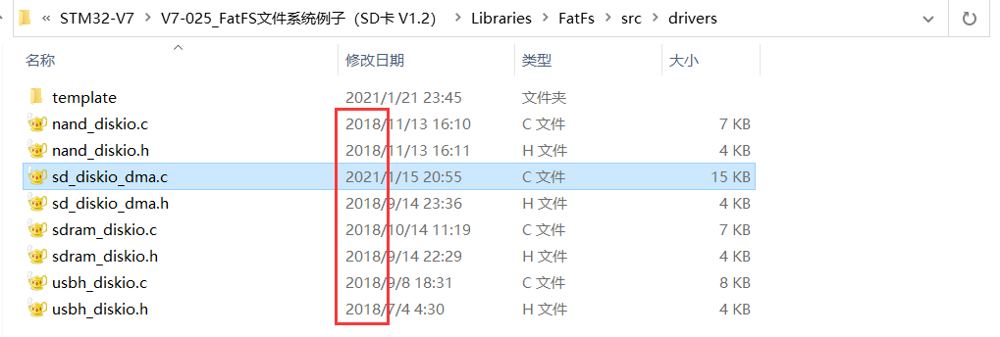

其中`sd_diskio_dma.c`的`SD_read()`部分源码如下

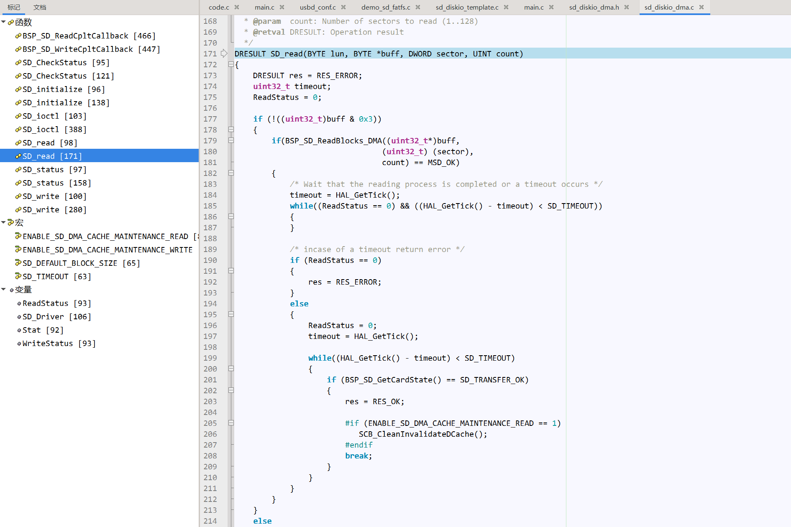

### 现在是 2023年！

本工程我使用 CubeIDE 1.11.2版本，其内嵌的 CubeMX 6.6 版本使用 STM32CubeH7 V1.11.0 的包，在 CubeMX内配置好后一键生成的代码文件路径 `H750VBT6_chapter_88\FATFS\` 有以下文件：

```
  FATFS
	|-- App
	|   |-- fatfs.c
	|   `-- fatfs.h
	`-- Target
		|-- bsp_driver_sd.c
		|-- bsp_driver_sd.h
		|-- fatfs_platform.c
		|-- fatfs_platform.h
		|-- ffconf.h
		|-- sd_diskio.c
		`-- sd_diskio.h
```

其中 `sd_diskio.c`的抬头版权的声明是 2023年，该文件操作SD卡的API写法和CMSIS OS紧密结合，并且调用了DMA API，再加上上文中 CubeMX 内配置 FatFs 可开启 支持CMSIS RTOS v2 的互斥锁，推测 **ST 的团队已经处理好了FATFS + IDMA + CMSIS OS + 多任务互斥访问 FatFs API**


看安富莱的教程，请务必注意考古！

## 测试：都是在Debug模式编译测试的

## 测试：三星_64G_EVO

格式化为FAT32

### 0: 打印菜单

```bash
[23:45:01.265] ------------------------------------------------
[23:45:01.265] 请选择操作命令:
[23:45:01.265] 1 - 显示根目录下的文件列表
[23:45:01.265] 2 - 创建一个新文件armfly.txt
[23:45:01.265] 3 - 读armfly.txt文件的内容
[23:45:01.265] 4 - 创建目录
[23:45:01.265] 5 - 删除文件和目录
[23:45:01.265] 6 - 读写文件速度测试
```

### 1: 显示根目录下的文件列表

```bash
[23:44:32.231] 【1 - ViewRootDir】
[23:44:32.231] UHS-I SD Card <50MB/S for SDR50, DDR50 Cards, MAX Clock < 50MHz OR 100MHz
[23:44:32.231] UHS-I SD Card <104MB/S for SDR104, MAX Clock < 108MHz, Spec version 3.01
[23:44:32.232] 属性        |  文件大小 | 短文件名 | 长文件名
[23:44:32.233] (0x22)目录            0  System Volume Information
[23:44:32.233] (0x32)文件       503277  20230215-1637_STLINK-V3MINIE-Box-V1.gcode
[23:44:32.233] (0x32)文件      1065228  20230301-2306_STLINK_V3MINIE_CASE_TOP+BACK.gcode
[23:44:32.233] (0x32)文件      2097152  Speed00.txt
[23:44:32.249] (0x32)文件        29782  beifen_config
[23:44:32.257] (0x32)文件        34463  config
[23:44:32.265] (0x32)文件       389776  FIRMWARE.CUR
[23:44:32.272] (0x16)目录            0  Gcode
[23:44:32.281] (0x16)目录            0  webif
```

### 2~5: 正常。略

### 6: 读写文件速度测试

> 注意上了 FatFs文件系统，如果不上估计更快

SDMMC 时钟源25MHz，分频 0，SDMMC 时钟25MHz

```c
[21:36:10.255] 【6 - TestSpeed】
[21:36:10.268] 开始写文件Speed00.txt 2048KB ...
[21:36:10.679] ........
[21:36:10.680]   写耗时 : 410ms   平均写速度
[21:36:10.679]  : 5115004B/S (4995KB/S)
[21:36:10.687] 开始读文件 2048KB ...
[21:36:10.797] [led_task] sysTick : 314002 ms
[21:36:11.095] ........
[21:36:11.095]   读耗时 : 408ms   平均读速度
[21:36:11.095]  : 5140078B/S (5019KB/S)
```

SDMMC 时钟源200MHz，分频 4，SDMMC 时钟50MHz

```c
[23:42:34.576] 【6 - TestSpeed】
[23:42:34.597] 开始写文件Speed00.txt 2048KB ...
[23:42:34.830] [led_task] sysTick : 5002 ms
[23:42:35.044] ........
[23:42:35.044]   写耗时 : 445ms   平均写速度
[23:42:35.044]  : 4712701B/S (4602KB/S)
[23:42:35.052] 开始读文件 2048KB ...
[23:42:35.426] ........
[23:42:35.426]   读耗时 : 374ms   平均读速度
[23:42:35.426]  : 5607358B/S (5475KB/S)
```

## 测试：闪迪 64G Ulra

exFAT 报错无法被 H7 发现 有效的分区，使用 DiskGenius格式化为FAT32后识别：


原因在CubeMX 配置我没有开启 exFAT支持：导致生成的的 ffconf.h 路径: FATFS/Target/ffconf.h 中 _FS_EXFAT 未使能

```c
#define _FS_EXFAT	0
/* This option switches support of exFAT file system. (0:Disable or 1:Enable)
/  When enable exFAT, also LFN needs to be enabled. (_USE_LFN >= 1)
/  Note that enabling exFAT discards C89 compatibility. */
```

ff.c 中有大量依赖 _FS_EXFAT 预处理的代码：


可以在 CubeMX 中 FATFS使能FS_EXFAT：


exFAT： 是微软为取代FAT32 而创建的新档案系统。 FAT32 和 exFAT 的主要差别在于exFAT 支持单个大于 4GB 文件

ChaN 老师对于 FatFs 支持 exFAT 机制的解释 [exFAT Filesystem](http://elm-chan.org/fsw/ff/doc/appnote.html#exfat)

### 1:

上位机使用 UTF8 编码：打印SD卡文件名出现乱码

```bash
[23:58:35.327] 【1 - ViewRootDir】
[23:58:35.327] Normal Speed Card <12.5MB/S, MAX Clock < 25MHz, Spec Version 1.01
[23:58:35.414] 属性        |  文件大小 | 短文件名 | 长文件名
[23:58:35.414] (0x22)目录            0  System Volume Information
[23:58:35.414] (0x32)文件       392184  FIRMWARE.CUR
[23:58:35.415] (0x32)文件            3  fp-info-cache
[23:58:35.415] (0x32)文件        33792  G031G8U6_BOOTLDR.bin
[23:58:35.415] (0x32)文件           62  �½��ı��ĵ�.txt
[23:58:35.415] (0x33)文件           65  DETAILS.TXT
[23:58:35.416] (0x32)文件          371  ���������ļ���.md
[23:58:35.416] (0x32)文件       238480  config.rar
[23:58:35.417] (0x32)文件        17608  config_jeep
[23:58:35.787] [led_task] sysTick : 5002 ms
[23:58:36.786] [led_task] sysTick : 6002 ms
[23:59:04.785] [led_task] sysTick : 7002 ms
[23:59:04.785] [led_task] sysTick : 34002 ms
[23:59:05.785] [led_task] sysTick : 35002 ms
```

上位机使用 GBK编码：打印SD卡文件名正常

```bash
[23:59:06.150] 銆� - ViewRootDir銆�
[23:59:06.150] UHS-I SD Card <50MB/S for SDR50, DDR50 Cards, MAX Clock < 50MHz OR 100MHz
[23:59:06.151] UHS-I SD Card <104MB/S for SDR104, MAX Clock < 108MHz, Spec version 3.01
[23:59:06.151] 灞炴��       |  鏂囦欢澶у皬 | 鐭枃浠跺悕 | 闀挎枃浠跺悕
[23:59:06.152] (0x22)鐩綍            0  System Volume Information
[23:59:06.152] (0x32)鏂囦欢       392184  FIRMWARE.CUR
[23:59:06.152] (0x32)鏂囦欢            3  fp-info-cache
[23:59:06.152] (0x32)鏂囦欢        33792  G031G8U6_BOOTLDR.bin
[23:59:06.152] (0x32)鏂囦欢           62  新建文本文档.txt
[23:59:06.152] (0x33)鏂囦欢           65  DETAILS.TXT
[23:59:06.153] (0x32)鏂囦欢          371  测试中文文件名.md
[23:59:06.153] (0x32)鏂囦欢       238480  config.rar
[23:59:06.154] (0x32)鏂囦欢        17608  config_jeep
[23:59:06.785] [led_task] sysTick : 36002 ms
[23:59:07.785] [led_task] sysTick : 37002 ms
```

由此推测CubeMX CODE_PAGE 配置为简体中文以GBK编码解析字符串，而c源码文件又是UTF8编码的，我的win10系统的编码是 GBK，那么在电脑端操作SD卡新建中文文件名是GBK编码的，win10可以将操作系统的编码改为 UTF8，但是是Beta功能，我以前试过会导致电脑的很多已安装的程序出现莫名奇妙的问题又改回GBK了，这个问题可以将工程源码文件的编码方式改为GBK解决，这样USB串口打印的字符串就从 UTF8 变为 GBK，和SD卡文件名的编方式一样了，推荐使用[基于python开发的编码转换工具](https://github.com/clorymmk/CodeTransmit)转换源码的编码

### 2~5: 正常。略

### 6:

```c
[00:11:03.831] 【6 - TestSpeed】
[00:11:03.835] 开始写文件Speed01.txt 2048KB ...
[00:11:04.121] ........
[00:11:04.121]   写耗时 : 286ms   平均写速度
[00:11:04.121]  : 7332699B/S (7160KB/S)
[00:11:04.126] 开始读文件 2048KB ...
[00:11:04.486] ........
[00:11:04.486]   读耗时 : 359ms   平均读速度
[00:11:04.486]  : 5841649B/S (5704KB/S)
```

## 测试：SD卡的ATTO性能：

这个肯定是USB3.0读卡器在 UHS-I 1.8V下跑的，比H7 在 3.3V下 HS跑的快很多

| 三星64G_EVO                                                  | 闪迪64G_Ultra                                                |
| ------------------------------------------------------------ | ------------------------------------------------------------ |
|  |  |

## 测试：不同 IO/SIZE 的读写性能

ATTO使用不同的IO/SIZE读写256MB的文件，测试次数为4次

做到类似ATTO的测试， 那么需要修改 WriteFileTest() 

WriteFileTest 函数通过 `for (i = 0; i < TEST_FILE_LEN / BUF_SIZE; i++)` 来计算读写次数，由于H7的AXI SRAM在本工程中还有 接近 500KB可用，g_TestBuf是 读写共用的 IO/SIZE 缓冲区，使用静态内存分配 32KB 在 AXI SRAM

```
#define BUF_SIZE				(32*1024)		/* 每次读写SD卡的最大数据长度: 32KB*/
ALIGN_32BYTES(uint8_t g_TestBuf[BUF_SIZE]);
```

将 BUF_SIZE  增大到 256KB，这应该是可在 H750VB 上测试的最大 IO/SIZE，相应地测试文件的尺寸也增大为8MB，512byte到256KB的IO/SIZE都读写8MB大小的文件测速，避免文件大小过小导致测速不准确

### 三星 64G EVO

```assembly
【6 - TestSpeed】
IO SIZE: 512byte
TEST FILE LEN: 8192KB
开始写文件Speed00.txt 8192KB ...
  写耗时 : 18512ms   平均写速度 : 221134B/S (442KB/S)
开始读文件 8192KB ...
  读耗时 : 6234ms   平均读速度 : 656663B/S (1314KB/S)
IO SIZE: 1KB
TEST FILE LEN: 8192KB
开始写文件Speed01.txt 8192KB ...
  写耗时 : 15676ms   平均写速度 : 261140B/S (522KB/S)
开始读文件 8192KB ...
  读耗时 : 4874ms   平均读速度 : 839893B/S (1680KB/S)
IO SIZE: 2KB
TEST FILE LEN: 8192KB
开始写文件Speed02.txt 8192KB ...
  写耗时 : 4377ms   平均写速度 : 935261B/S (1871KB/S)
开始读文件 8192KB ...
  读耗时 : 3173ms   平均读速度 : 1290148B/S (2581KB/S)
IO SIZE: 4KB
TEST FILE LEN: 8192KB
开始写文件Speed03.txt 8192KB ...
  写耗时 : 2274ms   平均写速度 : 1800193B/S (3602KB/S)
开始读文件 8192KB ...
  读耗时 : 2371ms   平均读速度 : 1726546B/S (3455KB/S)
IO SIZE: 8KB
TEST FILE LEN: 8192KB
开始写文件Speed04.txt 8192KB ...
  写耗时 : 1391ms   平均写速度 : 2942948B/S (5889KB/S)
开始读文件 8192KB ...
  读耗时 : 2049ms   平均读速度 : 1997872B/S (3998KB/S)
IO SIZE: 16KB
TEST FILE LEN: 8192KB
开始写文件Speed05.txt 8192KB ...
  写耗时 : 1027ms   平均写速度 : 3986018B/S (7976KB/S)
开始读文件 8192KB ...
  读耗时 : 1868ms   平均读速度 : 2191456B/S (4385KB/S)
IO SIZE: 32KB
TEST FILE LEN: 8192KB
开始写文件Speed06.txt 8192KB ...
  写耗时 : 998ms   平均写速度 : 4101844B/S (8208KB/S)
开始读文件 8192KB ...
  读耗时 : 1720ms   平均读速度 : 2380023B/S (4762KB/S)
IO SIZE: 64KB
TEST FILE LEN: 8192KB
开始写文件Speed07.txt 8192KB ...
  写耗时 : 998ms   平均写速度 : 4101844B/S (8208KB/S)
开始读文件 8192KB ...
  读耗时 : 1726ms   平均读速度 : 2371750B/S (4746KB/S)
IO SIZE: 128KB
TEST FILE LEN: 8192KB
开始写文件Speed08.txt 8192KB ...
  写耗时 : 979ms   平均写速度 : 4181451B/S (8367KB/S)
开始读文件 8192KB ...
Speed1.txt 文件读成功，但是数据出错
IO SIZE: 256KB
TEST FILE LEN: 8192KB
开始写文件Speed09.txt 8192KB ...
  写耗时 : 992ms   平均写速度 : 4126653B/S (8258KB/S)
开始读文件 8192KB ...
Speed1.txt 文件读成功，但是数据出错
```

### 闪迪64G Ultra

```assembly
【6 - TestSpeed】
IO SIZE: 512byte
TEST FILE LEN: 8192KB
开始写文件Speed00.txt 8192KB ...
  写耗时 : 24770ms   平均写速度 : 165266B/S (330KB/S)
开始读文件 8192KB ...
  读耗时 : 6577ms   平均读速度 : 622417B/S (1245KB/S)
IO SIZE: 1KB
TEST FILE LEN: 8192KB
开始写文件Speed01.txt 8192KB ...
  写耗时 : 13409ms   平均写速度 : 305290B/S (610KB/S)
开始读文件 8192KB ...
  读耗时 : 4083ms   平均读速度 : 1002606B/S (2006KB/S)
IO SIZE: 2KB
TEST FILE LEN: 8192KB
开始写文件Speed02.txt 8192KB ...
  写耗时 : 6878ms   平均写速度 : 595178B/S (1191KB/S)
开始读文件 8192KB ...
  读耗时 : 2823ms   平均读速度 : 1450102B/S (2901KB/S)
IO SIZE: 4KB
TEST FILE LEN: 8192KB
开始写文件Speed03.txt 8192KB ...
  写耗时 : 3676ms   平均写速度 : 1113612B/S (2228KB/S)
开始读文件 8192KB ...
  读耗时 : 2193ms   平均读速度 : 1866685B/S (3735KB/S)
IO SIZE: 8KB
TEST FILE LEN: 8192KB
开始写文件Speed04.txt 8192KB ...
  写耗时 : 1900ms   平均写速度 : 2154547B/S (4311KB/S)
开始读文件 8192KB ...
  读耗时 : 1833ms   平均读速度 : 2233300B/S (4469KB/S)
IO SIZE: 16KB
TEST FILE LEN: 8192KB
开始写文件Speed05.txt 8192KB ...
  写耗时 : 955ms   平均写速度 : 4286534B/S (8578KB/S)
开始读文件 8192KB ...
  读耗时 : 1703ms   平均读速度 : 2403781B/S (4810KB/S)
IO SIZE: 32KB
TEST FILE LEN: 8192KB
开始写文件Speed06.txt 8192KB ...
  写耗时 : 933ms   平均写速度 : 4387610B/S (8780KB/S)
开始读文件 8192KB ...
  读耗时 : 1645ms   平均读速度 : 2488535B/S (4979KB/S)
IO SIZE: 64KB
TEST FILE LEN: 8192KB
开始写文件Speed07.txt 8192KB ...
  写耗时 : 1091ms   平均写速度 : 3752191B/S (7508KB/S)
开始读文件 8192KB ...
  读耗时 : 1642ms   平均读速度 : 2493082B/S (4989KB/S)
IO SIZE: 128KB
TEST FILE LEN: 8192KB
开始写文件Speed08.txt 8192KB ...
  写耗时 : 862ms   平均写速度 : 4749003B/S (9503KB/S)
开始读文件 8192KB ...
Speed1.txt 文件读成功，但是数据出错
IO SIZE: 256KB
TEST FILE LEN: 8192KB
开始写文件Speed09.txt 8192KB ...
  写耗时 : 859ms   平均写速度 : 4765588B/S (9536KB/S)
开始读文件 8192KB ...
Speed1.txt 文件读成功，但是数据出错

```

### BUG?

IO/SIZE 为 128KB 和 256KB时，读取数据出错，原因是 128KB 就有 256 个 Block，超过了FatFS 最大128个 BLOCK大小

例如 `diskio.c` 的 `disk_read()` 的参数 count ，要求 Number of sectors to read (1..128)

```c
/**
  * @brief  Reads Sector(s)
  * @param  pdrv: Physical drive number (0..)
  * @param  *buff: Data buffer to store read data
  * @param  sector: Sector address (LBA)
  * @param  count: Number of sectors to read (1..128)
  * @retval DRESULT: Operation result
  */
DRESULT disk_read (
	BYTE pdrv,		/* Physical drive nmuber to identify the drive */
	BYTE *buff,		/* Data buffer to store read data */
	DWORD sector,	        /* Sector address in LBA */
	UINT count		/* Number of sectors to read */
)
```

例如 `sd_diskio.c` 的 `SD_read()` ，被是FatFs调用的函数，其参数 count ，要求也是 Number of sectors to read (1..128)

```c
/* USER CODE BEGIN beforeReadSection */
/* can be used to modify previous code / undefine following code / add new code */
/* USER CODE END beforeReadSection */
/**
  * @brief  Reads Sector(s)
  * @param  lun : not used
  * @param  *buff: Data buffer to store read data
  * @param  sector: Sector address (LBA)
  * @param  count: Number of sectors to read (1..128)
  * @retval DRESULT: Operation result
  */

DRESULT SD_read(BYTE lun, BYTE *buff, DWORD sector, UINT count)
```

### 读速度慢

随着每次block增大，写速度会从 400KB/s 增加到 9MB/s 左右，但是读取速度从 1MB 增加到 5000KB/s左右就不提升了，原因是WriteFileTest()内读取阶段加入了比较数据是否正确的代码段限制了读取速度：

```c
		for (i = 0; i < TEST_FILE_LEN / buf_size; i++)
		{
...
				/* 比较写入的数据是否正确，此语句会导致读卡速度结果降低到 3.5MBytes/S */
				for (k = 0; k < buf_size; k++)
				{
					if (g_TestBuf[k] != (k / 512) + '0')
					{
						err = 1;
						printf("Speed1.txt 文件读成功，但是数据出错\r\n");
						break;
					}
				}
            	 if (err == 1)
				{
					break;
				}
...
		}
```

将此部分注释掉，测速如下：

### 三星 64G EVO (读不进行校验)

```assembly
【6 - TestSpeed】
IO SIZE: 512byte
TEST FILE LEN: 8192KB
开始写文件Speed00.txt 8192KB ...
  写耗时 : 19582ms   平均写速度 : 209051B/S (418KB/S)
开始读文件 8192KB ...
  读耗时 : 5340ms   平均读速度 : 766599B/S (1534KB/S)
IO SIZE: 1KB
TEST FILE LEN: 8192KB
开始写文件Speed01.txt 8192KB ...
  写耗时 : 10931ms   平均写速度 : 374498B/S (749KB/S)
开始读文件 8192KB ...
  读耗时 : 4713ms   平均读速度 : 868584B/S (1738KB/S)
IO SIZE: 2KB
TEST FILE LEN: 8192KB
开始写文件Speed02.txt 8192KB ...
  写耗时 : 4341ms   平均写速度 : 943017B/S (1887KB/S)
开始读文件 8192KB ...
  读耗时 : 3522ms   平均读速度 : 1162305B/S (2325KB/S)
IO SIZE: 4KB
TEST FILE LEN: 8192KB
开始写文件Speed03.txt 8192KB ...
  写耗时 : 2266ms   平均写速度 : 1806549B/S (3615KB/S)
开始读文件 8192KB ...
  读耗时 : 2225ms   平均读速度 : 1839838B/S (3681KB/S)
IO SIZE: 8KB
TEST FILE LEN: 8192KB
开始写文件Speed04.txt 8192KB ...
  写耗时 : 1378ms   平均写速度 : 2970711B/S (5944KB/S)
开始读文件 8192KB ...
  读耗时 : 1428ms   平均读速度 : 2866695B/S (5736KB/S)
IO SIZE: 16KB
TEST FILE LEN: 8192KB
开始写文件Speed05.txt 8192KB ...
  写耗时 : 1601ms   平均写速度 : 2556927B/S (5116KB/S)
开始读文件 8192KB ...
  读耗时 : 1291ms   平均读速度 : 3170906B/S (6345KB/S)
IO SIZE: 32KB
TEST FILE LEN: 8192KB
开始写文件Speed06.txt 8192KB ...
  写耗时 : 1117ms   平均写速度 : 3664852B/S (7333KB/S)
开始读文件 8192KB ...
  读耗时 : 936ms   平均读速度 : 4373547B/S (8752KB/S)
IO SIZE: 64KB
TEST FILE LEN: 8192KB
开始写文件Speed07.txt 8192KB ...
  写耗时 : 996ms   平均写速度 : 4110081B/S (8224KB/S)
开始读文件 8192KB ...
  读耗时 : 879ms   平均读速度 : 4657156B/S (9319KB/S)
```

