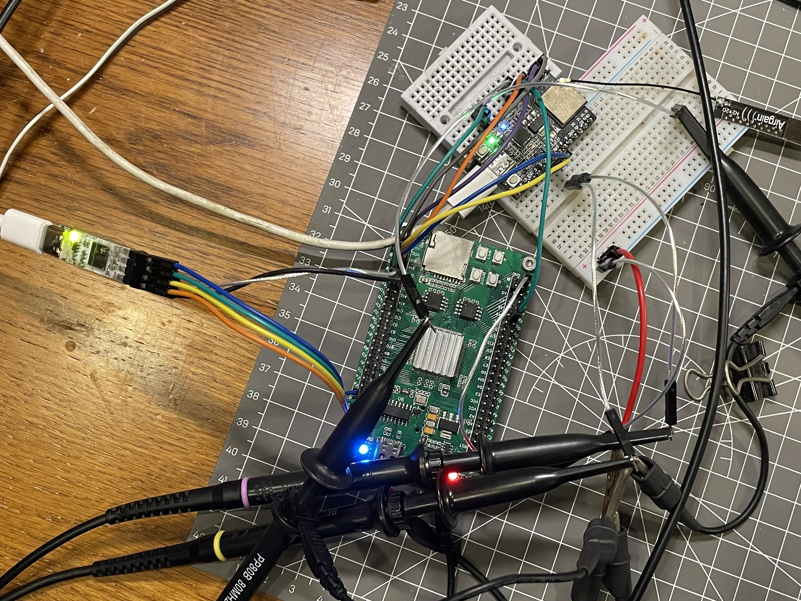
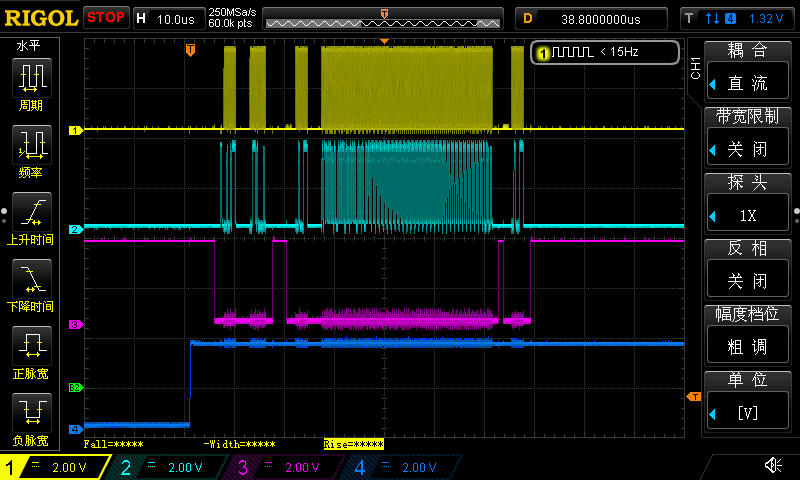
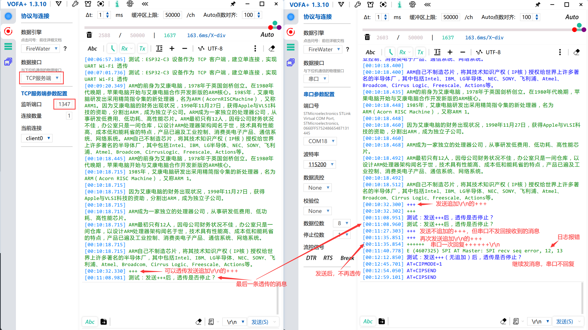

## ESP-AT | ESP32-C3 | 标准SPI 

## 2022/11/26

开坑

## 2022/12/21

> 关键功能测试OK

### 电路连接

使用 [ESP32-C3_SPI_AT指南 ](https://docs.espressif.com/projects/esp-at/zh_CN/release-v2.4.0.0/esp32c3/Compile_and_Develop/How_to_implement_SPI_AT.html)默认的连接方式

### 关于代码

UART驱动部分：使用[H750VBT6_usart_rx_idle_line_irq_ringbuff_tx_04](https://github.com/oldgerman/workspace_H7/tree/master/H750VBT6_usart_rx_idle_line_irq_ringbuff_tx_04)工程的实现

SPI驱动部分：将安富莱 bsp_spi_bus驱动的部分代码使用C++封装为FRTOS_SPIBase类，目前仅支持标准SPI，然后通过FRTOS_SPICmd类，实现SPI 命令序列，FRTOS_SPIDev_ESP32_C3_AT类继承FRTOS_SPICmd类，实现spi_device_polling_transmit()函数，即可与乐鑫SPI AT的 master端的ESP32示例代码对接（路径：`esp-at/examples/at_spi_master/spi/esp32_c_series/main/app_main.c`），然后修改一下，整合到主程序中

FreeRTOS：一共4个任务：UART和SPI分别对应两个阻塞式的高优先级任务，LED轮询任务（闪烁红色LED指示系统正在运行），空闲任务

### 测试：发送gkjhkljkhjhkggggggggggggggggggggggggggggg

**总波形：**

由上到下，SPI_CLK、SPI_MOSI、SPI_CS（软件CS）、HANDSHAKE引脚

这段波形根据 spi_trans_control_task()函数调用 ESP-AT的SPI传输报文T函数 的顺序，分为以下三个部分：

**第1部分波形：**

Master接收到HANDSHAKE高电平中断后，执行query_slave_data_trans_info()

对应通信报文：“Master 检测到握手线上有 slave 发出的信号后，需要发送一条消息查询 slave 进入接收数据的工作模式，还是进入到发送数据的工作模式”

.png)

**第2部分波形：**

由 at_spi_master_send_data() 发送数据

对应通信报文：“Master 向 slave 发送数据”

发送数据.png)

**第3部分波形：**

at_spi_master_send_data()发送结束传输指令

对应通信报文：“Master 向 slave 发送数据结束后，需要发送一条通知消息来结束本次传输”

发送结束的0x7指令.png)

### 测试：SPI转发串口发的复位命令，重启模块

串口录屏路径：`Images/测试：SPI转发串口发的复位命令，重启模块OK.mp4`

波形：SPI(CLK，MOSI，CS)和HANDSHAKE引脚的波形，从上到下

和handshake的波形.png)

### 测试：ESP-AT SPI 建立TCP客户端UART透传（SPI转发串口发的所有数据）

设置教程：[ESP32-C3 设备作为 TCP 客户端，建立单连接，实现 UART Wi-Fi 透传](https://docs.espressif.com/projects/esp-at/zh_CN/release-v2.4.0.0/esp32c3/AT_Command_Examples/TCP-IP_AT_Examples.html#id16)

初步测时是成功的，发送单独的+++帧退出透传还有BUG，待实现的解决思路：在usart任务中实现指令解析，丢弃+++后的\r\n

