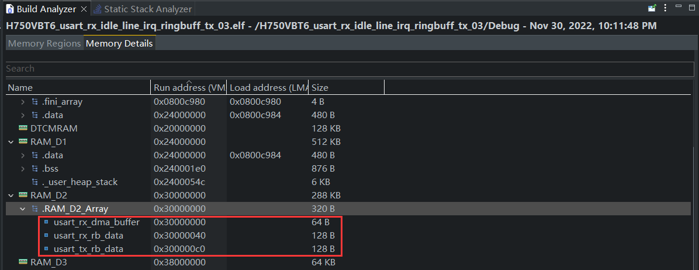

## HAL库、H750VBT6、USART、DMA、收不定长数据、空闲线路中断、环形缓冲区、发送数据

工程名称：H750VBT6_usart_rx_idle_line_irq_ringbuff_tx_03

- 完全使用HAL库API，无需修改stm32h7xx_it.c中的IRQHandler函数

- 开启MPU，开启Cache，但 MPU 将 SRAM1、SRAM2、SRAM3 共计288KB（128KB、128KB、64KB）划分为一个内存区（地址0x30000000开始），不开启Cache：


 GNU Link Script 文件 H750VBT6_usart_rx_idle_line_irq_ringbuff_tx_03_FLASH.ld内加了这样一段section:

```c
SECTIONS
{
......
  .RAM_D2_Array (NOLOAD):
  {
    . = ALIGN(4);
    *(.RAM_D3_Array)
    . = ALIGN(4);
  } >RAM_D2
......
}
```

补充一下，MEMORY段使用CubeMX默认的分配

```c
MEMORY
{
  FLASH (rx)     : ORIGIN = 0x08000000, LENGTH = 2048K
  DTCMRAM (xrw)  : ORIGIN = 0x20000000, LENGTH = 128K
  RAM_D1 (xrw)   : ORIGIN = 0x24000000, LENGTH = 512K
  RAM_D2 (xrw)   : ORIGIN = 0x30000000, LENGTH = 288K		/*注意：SRAM1、SRAM2、SRAM3 共计288KB（128KB、128KB、64KB）划分为一个内存区*/	
  RAM_D3 (xrw)   : ORIGIN = 0x38000000, LENGTH = 64K
  ITCMRAM (xrw)  : ORIGIN = 0x00000000, LENGTH = 64K
}
```

在cppports.cpp主程序中，对三个buffer加 `__attribute__((section(".RAM_D2_Array")))`

```c
uint8_t usart_rx_dma_buffer[64] __attribute__((section(".RAM_D2_Array")));
uint8_t usart_rx_rb_data[128] __attribute__((section(".RAM_D2_Array")));
uint8_t usart_tx_rb_data[128] __attribute__((section(".RAM_D2_Array")));
```

然后编辑即可将这三个缓冲区的运行域编译到 288KB的未开 Cache的内存内，程序可以正常收发数据：





如果想放到开Cache的内存，比如512KB的整块AXI SRAM内，比较简单的方法是在GNU Link Script内将这个内存划分为两个区，前一个区较小，但大于 三个缓冲区 大小的总和，例如划分1KB：

```c
MEMORY
{
  FLASH (rx)     : ORIGIN = 0x08000000, LENGTH = 2048K
  DTCMRAM (xrw)  : ORIGIN = 0x20000000, LENGTH = 128K
  RAM_D1_NO_CACHE (xrw)   : ORIGIN = 0x24000000, LENGTH = 2K  /*注意：划分 AXI SRAM开始的2KB做NO-CACHE内存*/
  RAM_D1 (xrw)   : ORIGIN = 0x240000800, LENGTH = 510K        /*注意：第二部分内存开始地址向后偏移 十进制的2048，即十六进制的 0x800*/
  RAM_D2 (xrw)   : ORIGIN = 0x30000000, LENGTH = 288K			
  RAM_D3 (xrw)   : ORIGIN = 0x38000000, LENGTH = 64K
  ITCMRAM (xrw)  : ORIGIN = 0x00000000, LENGTH = 64K
}
```

再划分一个MPU的内存区，不开Cache，按照 RAM_D1_NO_CACHE的范围，配置好起始地址 0x24000000 和 大小 2K

> 备注：MPU的内存区在嵌套或者重叠的时候有个优先级的问题。序号 15 的优先级最高，以此递减，但这里不需要考虑优先级和覆盖问题

同时，链接脚本也要增加这段

```c
SECTIONS
{
......
  .RAM_D1_NO_CACHE_Array (NOLOAD):
  {
    . = ALIGN(4);
    *(.RAM_D3_Array)
    . = ALIGN(4);
  } >RAM_D1_NO_CACHE
......
}
```

然后，对三个buffer加 `__attribute__((section(".RAM_D2_Array")))`，编译就OK

```c
uint8_t usart_rx_dma_buffer[64] __attribute__((section(".RAM_D1_NO_CACHE_Array")));
uint8_t usart_rx_rb_data[128] __attribute__((section(".RAM_D1_NO_CACHE_Array")));
uint8_t usart_tx_rb_data[128] __attribute__((section(".RAM_D1_NO_CACHE_Array")));
```

如果编译到开Cache的内存区域，程序不能正常打印或接收数据
